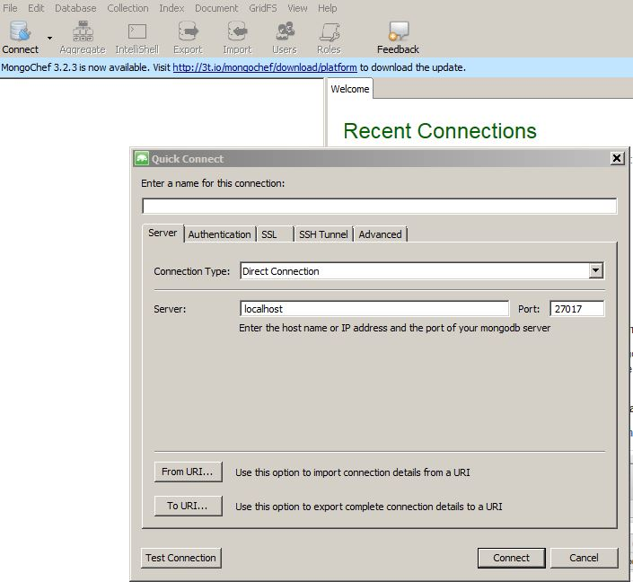
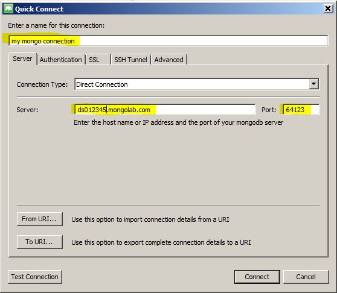

# Mongo DB Administration

Optional

Mongo DB ist eine eine Dokumentations - Datenbank, welche aus Collections (Sammlungen von Dokumenten) und Dokumenten besteht. Mongo DB ist eine [NoSQLDB](https://de.wikipedia.org/wiki/NoSQL) und schemafrei.Die Dokumente werden u.a. im JSON Format abgespeichert.  sinnvoll.

Ein Anbieter ist z.B. [3T Software Labs](http://3t.io/about-us) aus Berlin.
Der 3T MongoChef :http://3t.io/mongochef ist für den Privatgebrauch kostenlos.
Unter : http://3t.io/mongochef/download muss man sich registrieren und kann dann die Software für das jeweilige Betriebssystem herunterladen.

Die Installation z.B. unter Windows ist eine Standard - Installation ohne speziell benötigte Parameter.

Beim Aufruf wird man aufgefordert, eine Connection = Verbindung zur Mongo DB zu konfigurieren. Dieses ist die URI aus vorhergehendem Kapitel.

**Connection:**
Klicke **Connect**, dann öffnet sich folgendes Fenster:

