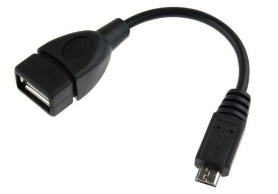
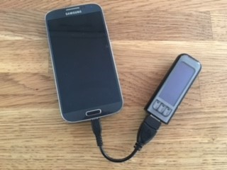
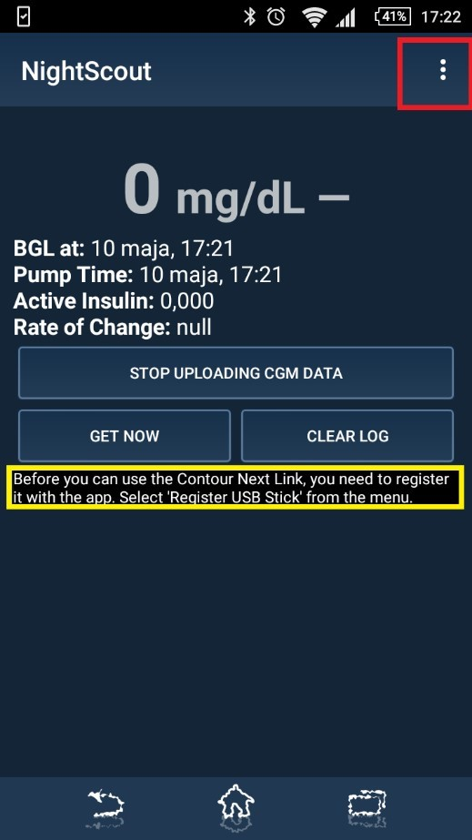

# Konfiguration des Android Smartphones mit dem Contour Next Link Messgerät 

 
Lade die aktuellste Version der Nightscout Uploader App auf dein Android 
Smartphone und installiere sie ([https://github.com/pazaan/640gAndroidUploader/releases](https://github.com/pazaan/640gAndroidUploader/releases)). 

Nachdem du die App installiert hast, verbinde dein Smartphone mit dem Contour Next Link 2.4 Messgerät über ein USB-OTG (On-The-Go) Kabel und starte die App: 
 

Im ersten Schritt musst du die Nutzungsbedingungen lesen und akzeptieren. Als nächstes musst du dein Contour Next Link Gerät registrieren. Dazu klicke auf die drei kleinen Menu-Punkte in der rechten oberen Ecke:

Solltest du keine drei Menu-Punkte sehen, musst du das Menu über deine Menu-Taste des Smartphones offnen:  
 
 
 
 
 
 
 
 
 
 
 
 
 
 
 
Klicke nun auf „Register USB Stick“: 
 
Gib nun deine Login Informationen von carelink.minimed.eu ein und drücke „RETRIEVE KEYS FOR USB“: 
 
  
 
Wenn die App den richtigen Schlüssel von CareLink bekommt, siehst du nun auf dem Bildschirm den ersten CGM-Wert: Gratuliere! 
 
  
 
 
Damit die CGM-Werte nun auch auf anderen mobilen Geräten abgelesen werden können, müssen wir noch einen Schritt machen. Gehe wiederum ins Menu der App und drücke auf „Preferences“: 
 
 
 
Aktiviere nun „REST API Upload“. Je nach Version der App musst du noch deine API Base URL eingeben, die so aussieht: 
https://deinAPI_SECRETPasswort@deinewebsite.azurewebsites.net/api/v1/	Es	kann	sein,	dass	dein	API_SECRET	Passwort	und	deine	Nightscout	Website	(deinewebsite.azurewebsites.net)	separat	verlangt	werden.	 
 
Nun kannst du auf deiner Website (deinewebsite.azurewebsites.net) die CGM-Werte ablesen (es kann einige Minuten in Anspruch nehmen, bis die Daten angezeigt werden): 
  
 
Als App zum Lesen der Kurve für Android empfehle ich „NightWatch“. Für iPhones empfehle ich die Apps „Nightscouter“ oder „Nightscout“.  
 
Sobald die Verbindung zwischen der Pumpe und der Android-Messgerät-
Verbindung unterbrochen wird (Distanz, Wackelkontakt des USB OTGKabels), werden keine CGM-Werte mehr aufgezeichnet. Sie werden zum jetzigen Zeitpunkt auch nicht nachgetragen, sobald die Verbindung wieder steht.  
 
Bei Problemen kannst du jederzeit die Community auf Facebook um Rat bitten (Gruppe für Deutschland heisst „Nightscout Deutschland (Germany)“).  
 
Nun viel Spass mit Nightscout - #WeAreNotWaiting ! 
