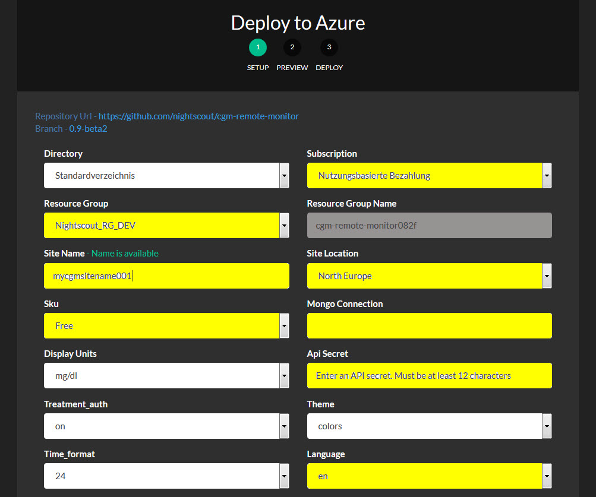

# Alternative und Optionale Installationsmethoden

# Unbeaufsichtigte Installation
Die Nightscout Website lässt sich mit vielen Standardeinstellungen beschleunigt installieren.
Wir Starten mit der Anmeldung in Azure.
Danach melden wir uns in Github an, navigieren in unserer Repository und den Branch, welchen wir installieren wollen.

Weiter Klicken auf das **Deploy to Azure** Symbol:

Es erscheint eine Web - Maske, in der wir alle gelb markierten Felder ausfüllen oder ändern:

**Resource Group**: Die Nightscout Website ist eine **Resource**, die einen **Wartungsplan** benötigt. Im Wartungsplan ist auch der Tarif gespeichert. Einzelne Resourcen werden zu einer Resourcengruppe zusammnegefasst. Hier geben wir einen Namen für die Gruppe ein.

**Subscription**: Standardwert: **Nutzungsbasierte Bezahlung**. Hier bitte nichts ändern.

**Site Name:** Name Deiner Website

**Site Location:** Region, in der die Website gehostet wird, ggf. den Wert auf **North Europe** ändern.

**Sku:** Tarif, **Free** ist Standardwert

**Mongo Connection:** Vollständiger Connection String der mongoDB mit Angabe der Datenbank.

**Api Secret:** API Secret Wert, bleibt der Wert unter 12 Zeichen, bricht die Installation ab.

**Language:** Standart Wert ist **en**, bitte in **de** wechseln.

Weitere Werte kann man ändern, wenn man möchte. Am Ende geht es mit **Weiter** weiter. Im Hintergrund installiert sich jetzt die Website mit den vorbelegten einstellungen. Diese werden als Schlüssel mit Werten in den Azure **Anwendungseinstellungen** gespeichert.

# Installation ohne Cloud Service Provider

Nightscout lässt sich autark installieren, das beteutet die Website liegt auf einem eigenen Server, welcher eine Verbindung in das Internet benötigt. folgender Link beschrreibt die Installation und Konfiguration eines windows server 2012, IIS und Nightscout Website:

[Nightscout on Windows Server](https://github.com/jaylagorio/Nightscout-on-Windows-Server)

