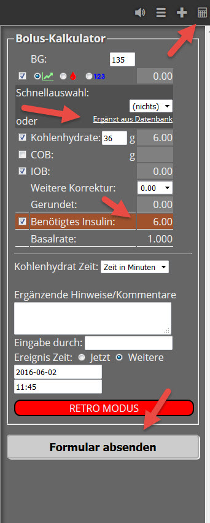

# Bolus Rechner

Der Bolus Rechner berechnet die abzugebende Insulinmenge für eine Mahlzeit. Wir erreichen das Menü durch Klick auf das Rechner - Sysmbol ganz oben rechts:

Die KHs können entweder manuell oder über gespeicherte Mahlzeiten aus der Nahrungsmittel - Tabelle eingegeben werden.
Der Bolus Rechner greift auf Werte aus dem `Profil Editor` zu, genauer dem `ISF` und dem ....
mit `Formular absenden` werden die Daten gespeichert.

Weiter geht es mit der [Smartwatch Integration](../smartwatch/smartwatch_integration.md)
