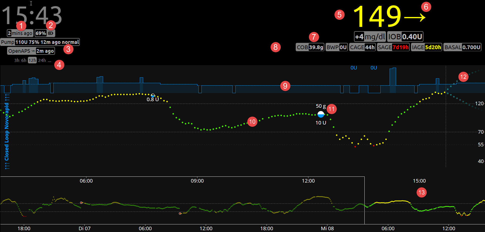
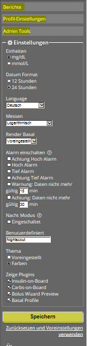

# Haupt Seite

Nightscout ist seit Oktober 2016 in der Version **0.9** - **Grilled Cheese** verfügbar. Wer Vorgängerversionen nutzt,
muss Einstellungen für die Website in Azure oder Heroku überprüfen und ergänzen.

Variable unter den App - Einstellungen  zum Hinzufügen: `AUTH_DEFAULT_ROLES` mit `readable`, `status-only` als mögliche Werte.
evicestatus-Upload

Wenn wir die Website aktualisieren und feststellen, dass Dinge, die wir aktiviert haben, nicht richtig angezeigt werden (wie boluscalc), bitte folgendes überprüfen:

**Bitte Sicherstellen, dass es nur eine die ENABLE - Zeile in den gesamten Einstellungen der Website gibt. (Das bedeutet nur ein einziges Mal in den Gesamteinstellungen, einschließlich App-Einstellungen und Verbindungszeichenfolgen.)
 Wenn ENABLE in Connection Strings auftaucht , bitte in die App Settings verschieben. Speichern nicht vergessen und anschließend die Website Stoppen und Starten.**

**Grilled Cheese** benötigt ein **Profil**

Wenn wir zuvor kein Profil auf der Website eingerichtet haben, werden wir beim ersten Aufruf der Website aufgefordert,ein Profil zu erstellen. Wir können alle Informationen eingeben, oder nur die Zeitzone (und das Profil später bearbeiten). Wir müssen die Website authentifizieren, bevor wir die Profiländerungen speichern können. Um sich zu authentifizieren, verwenden wir den Link am unteren Rand des Profils Bildschirms und geben das **API SECRET** ein. Sobald wir authentifiziert sind, ändern wir das  Profil und klicken  dann auf **Speichern**. Wenn das Profil korrekt gespeichert ist, sehen wir  **Erfolg** unten und rechts oben. Wir können nun die Website öffnen.

Wir sehen uns nun die **Hauptseite:** an.

Was sehen wir ?
  1. Zeit seit der Letzten CGM Sensor - Daten - Übertragung
  2. Batterie - Ladezustand des Smartphones
  3. Plugins für die Pumpensteuerung
  4. Zeitrahmen der Darstellung von Behandlungsdaten
  5. aktueller BZ - Wert
  6. Trendpfeilangabe
  7. Zunahme/Abnahme des BZ innerhalb von 2 Messpunkten
  8. Plugins mit Anzeige von  Werten wie  `Sensor - Alter` , `Insulin on Board`
  9. Basalratenverlauf
  10. CGM - Meßwerte
  11. Behandlungsdaten Kohenhydrate - und Insulineinheiten
  12. BZ - Trend - Voraussage
  13. Zeitfenster der Darstellung im oberen Bereich
  
  
**Menü - Auswahlfelder**

Nach dem erstmaligen Aufruf rufen wir die **Einstellungen** auf. Hier kann man
weiter zu **Berichte**, **Profil-Einstellungen**, **Admin Tools** gelangen.
Über die Auswahlfelder konfiguriert man das Erscheinungsbild, die Sprache, Alarme
und Plugins. Bei Änderungen **Speichern** nicht vergessen.

**Einstellungen:**

Wir machen weiter mit den **Profil-Einstellungen**. Neben allgemeinen Einstellungen
 wird hier auch eingestellt, ob die Plugins angezeigt werden sollen, oder nicht.
Für Änderungen muss das Gerät, wie z.B. der Laptop authentifiziert sein, dazu ist das 
[API SECRET](../nightscout/azure.md) einzugeben. Am Ende machen wir ein **Update record/Speichern**.

**Profil-Einstellungen:**

Die Dateneingabe erfolgt über das **+** Symbol der Website. Es gibt **Auswahl**- und **Werte**- Felder. Einige Plugins, wie bwp, benötigen hier Eingaben, damit sie Werte berechnen können. Mit **Eingabe senden** erscheint noch ein Bestätigungsbutton, klickt man diesen, werden die Werte gespeichert.

**Admin Tools**

Mit den Admin Tools ist es möglich, Daten zu löschen. Dieses betrifft im wesentlichen Nutzer der Nightscout Uploader App, welche Daten vom Dexcom Receiver via USB Kabel an das Android Smartphone übertragen. Bevor hier etwas geklickt wird, bitte genau überlegen, ob dieses wirklich nötig ist.

**Dateneingabe:**

Für die Dateneingabe muss das Plugin **careportal** mit **ENABLE** über [Azure](../nightscout/azure.md) konfiguriert sein.

**Grafische Darstellungen**

Grafik wird alle 60 Sekunden aktualisiert ?. Neben dem reinen CGM - Verlauf
werden auch Careportal Eingaben dargestellt. Die **Basalraten Visualisierung**
zeigt, sofern über die Azure App.-Einstellungen (basal) eingetragen und über den Profil Editor konfiguriert, den Verlauf an. Dieses ist geade für temporäre Basalraten interessant.

*****************************

Wir sehen uns den   [Profil Editor](../nightscout/nightscout_plugins.md) jetzt näher an.

