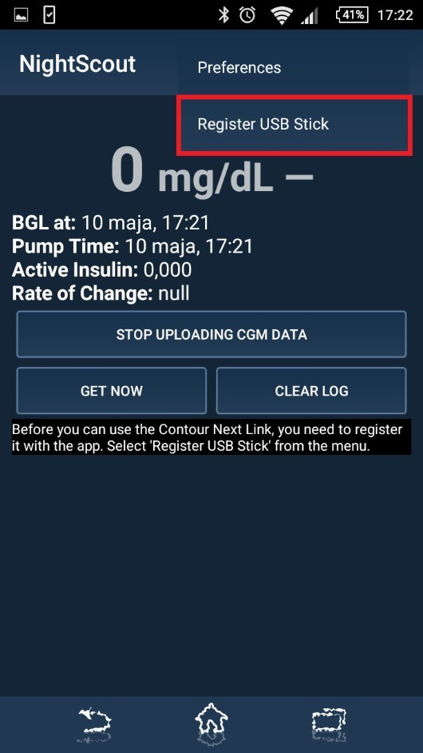

Konfiguration des Android Smartphones mit dem Contour Next Link Messgerät
=========================================================================

| Lade die aktuellste Version der Nightscout Uploader App auf dein
  Android
| Smartphone und installiere sie
  (https://github.com/pazaan/640gAndroidUploader/releases).

| Nachdem du die App installiert hast, verbinde dein Smartphone mit dem
  Contour Next Link 2.4 Messgerät über ein USB-OTG (On-The-Go) Kabel und
  starte die App:
| |OTG|
| |Setup|

| Im ersten Schritt musst du die Nutzungsbedingungen lesen und
  akzeptieren. Als nächstes musst du dein Contour Next Link Gerät
  registrieren. Dazu klicke auf die drei kleinen Menü-Punkte in der
  rechten oberen Ecke:
| |Menu1|

| Solltest du keine drei Menü-Punkte sehen, musst du das Menü über deine
  Menü-Taste des Smartphones öffnen:
| |Menu2|

| Klicke nun auf „Register USB Stick“:
| |USBStick|

| Gib nun deine Login Informationen von carelink.minimed.eu ein und
  drücke „RETRIEVE KEYS FOR USB“:
| |Keys|

| Wenn die App den richtigen Schlüssel von CareLink bekommt, siehst du
  nun auf dem Bildschirm den ersten CGM-Wert: Gratuliere!
| |CGM|

| Damit die CGM-Werte nun auch auf anderen mobilen Geräten abgelesen
  werden können, müssen wir noch einen Schritt machen. Gehe wiederum ins
  Menü der App und drücke auf „Preferences“:
| |Preferences|

| Aktiviere nun „REST API Upload“. Je nach Version der App musst du noch
  deine API Base URL eingeben, die so aussieht:
| ``https://``\ **deinAPI\_SECRETPasswort**\ ``@``\ **deinewebsite**\ ``.azurewebsites.net/api/v1/``
  Es kann sein, dass dein API\_SECRET Passwort und deine Nightscout
  Website (deinewebsite.azurewebsites.net) separat verlangt werden.
| |API|

| Nun kannst du auf deiner Website (deinewebsite.azurewebsites.net) die
  CGM-Werte ablesen (es kann einige Minuten in Anspruch nehmen, bis die
  Daten angezeigt werden):
| |Nightscout|

Als App zum Lesen der Kurve für Android empfehle ich „NightWatch“. Für
iPhones empfehle ich die Apps „Nightscouter“ oder „Nightscout“.

| Sobald die Verbindung zwischen der Pumpe und der Android-Messgerät-
| Verbindung unterbrochen wird (Distanz, Wackelkontakt des USB-OTG
  Kabels), werden keine CGM-Werte mehr aufgezeichnet. Sie werden zum
  jetzigen Zeitpunkt auch nicht nachgetragen, sobald die Verbindung
  wieder steht.

Bei Problemen kannst du jederzeit die Community auf Facebook um Rat
bitten (Gruppe für Deutschland heißt „Nightscout Deutschland
(Germany)“).

Nun viel Spaß mit Nightscout - #WeAreNotWaiting !

.. |OTG| image:: ../../images/640g/app1.jpg
.. |Setup| image:: ../../images/640g/app2.jpg
.. |Menu1| image:: ../../images/640g/app3.jpg
.. |Menu2| image:: ../../images/640g/app4.jpg

.. |Keys| image:: ../../images/640g/app6.jpg
.. |CGM| image:: ../../images/640g/app7.jpg
.. |Preferences| image:: ../../images/640g/app8.jpg
.. |API| image:: ../../images/640g/app9.jpg
.. |Nightscout| image:: ../../images/640g/app10.jpg

