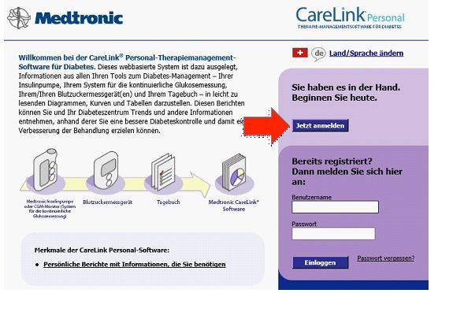
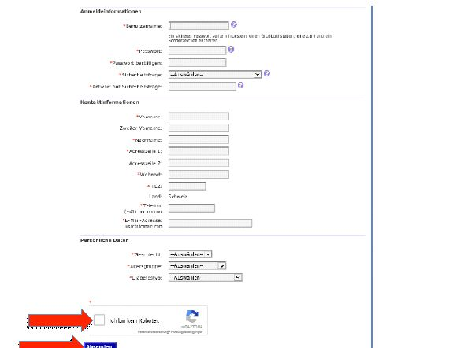
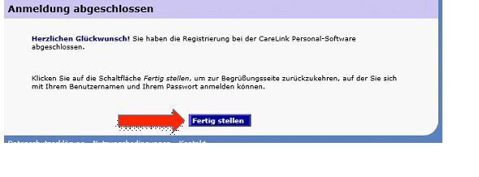
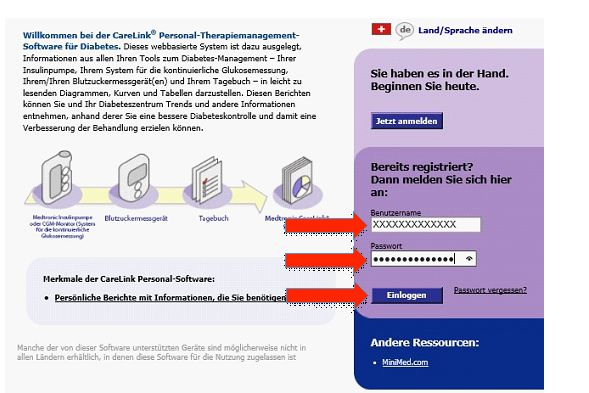
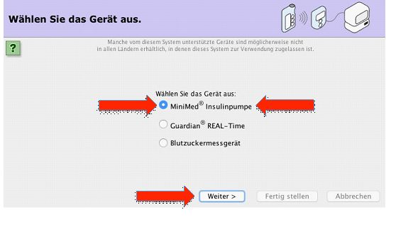
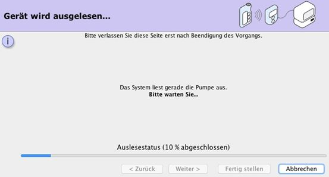

Anlegen eines Kontos auf https://carelink.minimed.eu
====================================================

Wir benötigen ein Konto auf CareLink und müssen mindestens einmal die
Pumpendaten über das Contour Next Link 2.4 Messgerät auf Carelink
hochladen.

Gehe auf https://carelink.minimed.eu und klicke auf „Jetzt anmelden“:

|Anmeldung|

Wähle dein Land und deine Sprache aus:

|Sprache|

| Nach dem Durchlesen der Nutzungsbedingungen akzeptiere diese, indem du
  diese drei Checkboxen klickst und „Akzeptieren“ klickst:
| |Checkboxen|

Fülle nun das Formular mit deinen Angaben aus. Bestätige, dass du kein
Roboter bist, und klicke auf „Absenden“:

|Absenden|

Nach dem „Absenden“ erscheint eine Bestätigungsseite:

|Bestaetigung|

| Nachdem du auf „Fertig stellen“ klickst, kommst du auf die Startseite
  zum Login.
| Gib deine vorhin erstellten Benutzernamen und Passwort ein und klicke
  auf „Einloggen“:

|Einloggen|

Wechsle nun auf den Reiter „Hochladen“:

|Hochladen|

| **Stecke** nun dein Contour Next Link 2.4 Messgerät in einen
  USB-Stecker deines Computers.
| **WICHTIG** ist, dass dieses Messgerät mit der Minimed 640G Pumpe
  bereits verbunden/gepaart wurde. (Eine Anleitung dazu findest du
  `hier <http://diabetes.ascensia.de/datafiles/pdf/userguides/Contour_NEXT_Link_2_4_User_Guide_de_mgdl.pdf>`__.)
| **Die Pumpe** bzw. der/die Pumpenträger\_in muss sich nun in der Nähe
  des Computers bzw. des angeschlossenen Messgeräts befinden.

(Java muss auf dem Computer installiert sein und die Ausführung von Java
erlaubt werden).

**WICHTIG** ist, als Gerät „Minimed Insulinpumpe“ auszuwählen. Klicke
nun auf „Weiter“

|Auswahl|

Wähle nun „Minimed Serie 600“ und klicke auf „weiter“:

Du wirst nun gebeten

-  eine laufende Bolusabgabe abzuwarten/abzubrechen
-  eine laufende temporäre Basalrate abzuwarten/abzubrechen
-  zu kontrollieren, dass die Pumpenbatterie nicht schwach ist
-  etwaige Fehlermeldungen auf der Pumpe zu löschen

Sofern alles stimmt, klicke auf „Weiter“

|Pumpenstatus|

Nun musst du die Seriennummer der Pumpe eingeben und auf „Weiter“
klicken:

|Seriennummer|

Wähle nun das Contour Next Link Messgerät aus und klicke auf „Weiter“:

|AuswahlVerbindung|

Stelle sicher, dass alle aufgeführten Punkte zutreffen und klicke auf
„Fertigstellen“:

|Fertig|

Die Pumpendaten werden nun ausgelesen:

|Auslesen|

**Wichtig:** *Sollte die Verbindung zwischen Pumpe und Messgerät
unterbrochen werden (z.B. durch das Auslesen der Pumpendaten in CareLink
Pro bei einer 3-Monatskontrolle) kann es sein, dass das Auslesen auf
CareLink (wie eben durchgeführt) erneut notwendig wird. Damit das nicht
passiert empfiehlt es sich, ein zusätzliches Contour Next Link 2.4
Messgerät anzuschaffen, welches nur in Verbindung mit dem Android
Smartphone steht und nicht für etwaiges manuelles Hochladen von
Pumpendaten gebraucht wird (muss allerdings ebenfalls einmalig zum
Auslesen der Pumpendaten gebraucht worden sein!).*

.. |Sprache| image:: ../../images/640g/carelink2.jpg
.. |Checkboxen| image:: ../../images/640g/carelink3.jpg

.. |Hochladen| image:: ../../images/640g/carelink7.jpg

.. |Pumpenstatus| image:: ../../images/640g/carelink10.jpg
.. |Seriennummer| image:: ../../images/640g/carelink11.jpg
.. |AuswahlVerbindung| image:: ../../images/640g/carelink12.jpg
.. |Fertig| image:: ../../images/640g/carelink13.jpg

