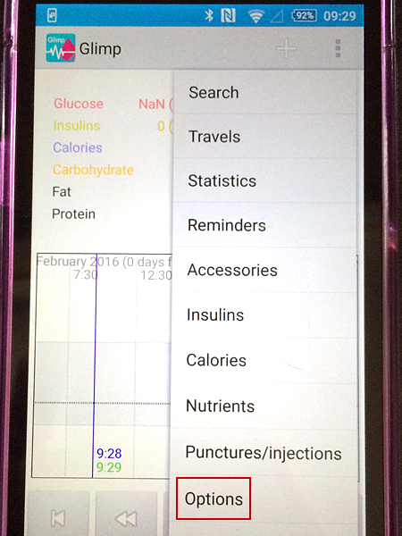
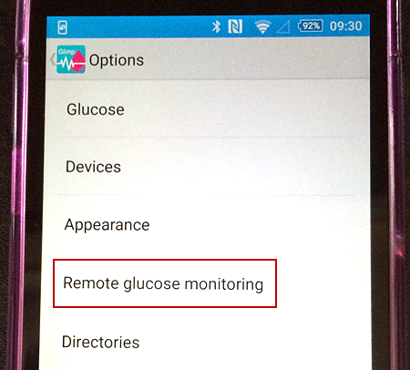
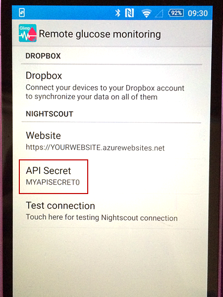
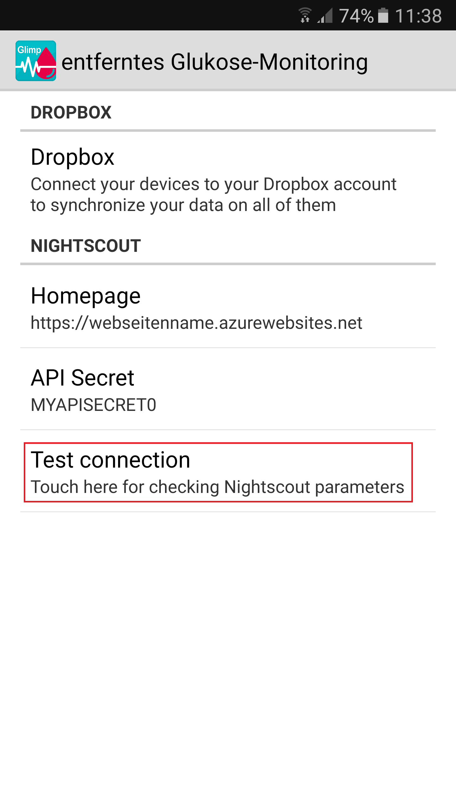

Nightscout mit FreeStyle Libre
==============================

Um Nightscout mit dem FreeStyle Libre nutzen zu können, braucht man:

-  ein funktionierendes FreeStyle Libre System
-  eine eingerichtete Nightscout Seite
-  ein Android Smartphone, das NFC (Nahfeldkommunikation) unterstützt
-  die `Glimp
   App <https://play.google.com/store/apps/details?id=it.ct.glicemia>`__
   aus dem Google Play Store

Falls man bisher noch keine Nightscout Seite eingerichtet hat, findet
man alle erforderlichen Schritte im Kapitel `Nightscout
einrichten <../nightscout/nightscout_einrichten.md>`__. Wichtig ist
dabei darauf zu achten, dass in Azure bzw. Heroku das CarePortal
eingeschaltet wurde (dies geschieht, in dem man "careportal" bei der
"ENABLE" Variable eingfügt. Auch muss in Azure bzw. Heroku ein
"API\_SECRET" gesetzt worden sein. Dies klingt komplizierter als, es in
Wirklichkeit ist. Am besten Schritt für Schritt der Anleitung folgen ;-)

Viele aktuelle Android Smartphones unterstützen die NFC Technologie.
Eine sehr gute, englischsprachige Liste findet man
`hier <http://www.nfcworld.com/nfc-phones-list/>`__.

Daten des FreeStyle Libre mit Glimp hochladen
=============================================

Um die Daten auf der Nightscout Seite angezeigt zu bekommen, müssen
diese mit der Glimp App über das Smartphone vom Sensor gelesen werden
und die App sendet die Daten dann zu Nightscout. Folgende Schritte sind
dazu nötig:

#. die `Glimp
   App <https://play.google.com/store/apps/details?id=it.ct.glicemia>`__
   aus dem Google Play Store laden
#. Glimp konfigurieren damit es mit dem FreeStyle Libre zusammen
   arbeitet - das bedeutet am Telefon NFC einschalten und mit dem
   Smartphone den bereits gestarten Sensor scannen. Wenn nötig, dann
   kann man in der App auch noch eine Kalibrierung veranlassen, in dem
   man auf das "**+**" Zeichen klickt und einen BZ Wert eingibt
   (eventuell mehrmals wiederholen).
#. Glimp für die Zusammenarbeit mit Nightscout konfigurieren. Dazu auf
   die 3 Punkte in der rechten, oberen Ecke klicken und danach auf
   "**Optionen**" klicken.
   |image0|
#. Jetzt "**entferntes Glucose-Monitoring**" wählen.
   |image1|
#. Auf der "entferntes Glucose-Monitoring"-Seite, gibt man jetzt die
   vorher erstellte Nightscout URL ein.
   |image2|
#. Jetzt das API SECRET eingeben (Anmerkung: das API SECRET *muss*
   identisch sein, mit das man bei der Konfiguration der Nightscout
   Seite bei Azure bzw. Heroku gesetzt hat.)
   |image3|
#. Nun auf "**Test connection**" klicken.
   |image4|
#. Wenn der Test erfolgreich war, dann ist Glimp nun fertig konfiguriert
   und lädt ab jetzt die mit der Glimp App gescannten Werte des Libre
   auf die Nightscout Seite.

.. _Libre als CGM:

Libre als CGM
=============

**LimiTTer**

Dank eines DIY Projektes ist es bereits heute möglich, den Libre Sensor
mit einem selbst zu bastelnden Transmitter auszustatten, der dann
automatisch alle 5 Minuten Werte scannt und an ein Android Smartphone
überträgt. Auf diesem muss die XDrip App installiert sein, die die Daten
sowohl anzeigen kann, als auch an Nightscout oder eine Smartwatch
senden. Wie das geht steht `hier <https://joernl.github.io/LimiTTer/>`__
auf Englisch.

**blueReader**

Mittlerweile gibt es auch ein Projekt, das sich an alle wendet, die
nicht so gerne mit dem Lötkolben arbeiten und trotzdem den Libre mit dem
Funktionsumfang eines CGM-Systems nutzen möchten. Der blueReader soll
wasserdicht und klein sein. Wer sich über den aktuellen Stand
informieren möchte, kann dies in dem Blog `Sandras
Place <http://unendlichkeit.net/wordpress/>`__ machen. Damit dieses
Projekt allerdings realisiert werden kann, wurde ein `crowdfunding
Projekt <https://www.startnext.com/bluereader>`__ ins Leben gerufen,
welches auf finanzielle Unterstützung angewiesen ist.

.. |image2| image:: ../../images/libre/glimp3.png

