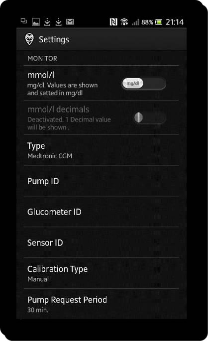
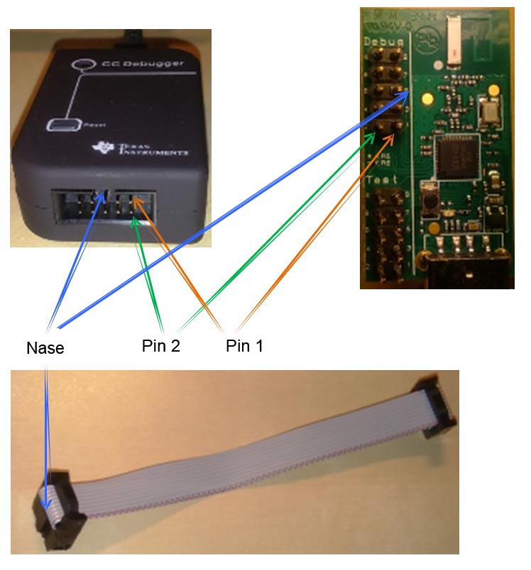

===========
MMCommander
===========

Der MMCommander stellt die Schnittstelle zwischen dem MiniLink
Transmitter (für die Veo) und einem (kompatiblen) Android Smartphone
dar. Derzeit wird damit das "alte" System, bestehend aus Enlite Sensor,
MiniLink Transmitter und VEO Insulinpumpe, unterstützt.

Benutzer der Medtronic 640G und deren CGM Komponenten sollten sich den
Unterpunkt Guardian 2 Link Transmitter des Kapitels
`Enlite <../cgm/enlite.md>`__ ansehen.

Das Grundprinzip ist, dass der MMCommander die vom Transmitter an die
Pumpe übertragenen Werte "mithört" und diese dann per Medtronic Uploader
Android App entweder per Wi-Fi oder mobilem Telefon Netzwerk an
Nightscout überträgt (vgl. Übersichtsgrafik im Unterpunkt MiniLink
Transmitter des Kapitels `Enlite <../cgm/enlite.md>`__).

**Wichtig:**

Der Hersteller Medtronic hat mit dem hier beschriebenen Projekt nichts
zu tun und alle Informationen, die sich hier befinden, werden auf
eigenes Risiko benutzt. Informationen, die mithilfe dieses Projektes
erlangt werden, dürfen niemals als Grundlage für eine medizinische
Entscheidung benutzt werden.

Hardware
--------

Um den MMCommander zu bauen, wird folgende Hardware benötigt:

-  ein "geeignetes" **Android Smartphone** mit USB OTG Unterstützung.

Ob ein bereits vorhandenes Smartphone geeignet ist, lässt sich leider
nicht sicher vorhersagen. Als Orientierung kann man sich auf
`www.nightscout.info <http://www.nightscout.info>`__ eine Liste mit
bestätigten Smartphones ansehen:
(`Liste <http://www.nightscout.info/wp-content/uploads/2015/02/Nightscout-OTG-Database_CGMitC.xlsx.pdf>`__).
Zusätzlich gibt es eine Liste mit Smartphones, die laut Nightscout.info
**nicht** funktionieren:

-  Kyocera Hydro
-  Samsung Mini – alle Modelle
-  Moto E
-  Straight Talk LG L34C Optimus Fuel
-  LG Realm
-  HTC Desire (außer AT&T Version)
-  Core Prime
-  Droid Bionic
-  Droid Razr Maxx
-  Droid Razr
-  Geräte mit **Blackberry** Betriebssystem
-  Geräte mit **iOS** Betriebssystem (Apple - Geräte)

Zusätzlich zu den Infos der Nightscout-Seite gibt es einen Bericht, bei
dem ein HTC One (M7) mit Android 5.1 "Lollipop" nicht stabil
funktionierte. Erfolgreich läuft der MMCommander mit einem Sony Xperia
Z3 - ebenfalls mit Android 5.1 "Lollipop". Dieses Smartphone hat den
Vorteil, dass man es über einen weiteren magnetischen Anschluss laden
kann, während die Micro USB Buchse durch den MMCommander blockiert ist.
Im Internet scheinen sich übrigens viele Nightscout-Benutzer für das
kostengünstige Motorola Moto G entschieden zu haben.

-  ein **USB-OTG Kabel** (Micro-USB Stecker auf normale USB Buchse) -
   zumeist empfiehlt es sich, einen gewinkelten USB-Stecker zu nehmen,
   wobei die sinnvolle Richtung vom verwendeten Smartphone abhängt. Man
   findet eine relativ große Auswahl bei Ebay oder Amazon. Die Kosten
   betragen etwa 5 €.

|usb_otgklein|

-  einen **CC1111 USB Dongle**, diesen Funk-Sender-Empfänger kann man
   z.B. für 67 € bei
   `Farnell <http://de.farnell.com/texas-instruments/cc1111emk868-915/cc1111-rf-transceiver-eval-module/dp/2334589>`__
   oder
   `Digi-Key <http://www.digikey.de/product-detail/de/CC1111EMK868-915/296-22732-ND/1739551>`__
   bestellen.

|cc1111_dongle|

-  zumindest einmalig zum Programmieren des CC1111 USB Dongles einen
   **CC Debugger**. Dieser kann für rund 44 € z.B. ebenfalls bei
   `Farnell <http://de.farnell.com/texas-instruments/cc-debugger/prog-debugger-f-rf-soc/dp/1752232?MER=baynote-1752232-pr>`__
   oder
   `Digi-Key <http://www.digikey.de/product-detail/de/CC-DEBUGGER/296-30207-ND/2231678>`__
   bestellt werden.

|ccdebugger|

-  nicht zwingend notwendig, aber durchaus sinnvoll ist ein
   **Schutzgehäuse** für den CC1111. Es gibt bereits ein Plastikgehäuse,
   welches man
   `hier <http://www.shapeways.com/product/PGQ26J9UG/ti-cc1111-rf-transceiver-protective-case?li=shop-results&optionId=40496519>`__
   für knapp 20 € erwerben kann. Da der Anbieter mit dem Gehäuse kein
   Geld verdienen, sondern nur andere Nutzer unterstützen möchte, bietet
   er auch alternativ die Pläne
   `hier <https://www.tinkercad.com/things/2TzPZp0T0p1-cc1111-stick-usb-cable-protector>`__
   umsonst an, so dass man diese auch bei einem 3D Druck Service nach
   Wahl realisieren kann.
   Eine weitere Möglichkeit ist die Benutzung einer Tic-Tac Dose.

|tictac|

Software
--------

| Um den CC1111 USB Dongle mit der entsprechenden Software zu
  beschreiben, braucht man ein Windows Programm, welches `Smart RF Flash
  Programmer <http://www.ti.com/tool/flash-programmer>`__ heißt
  (Achtung: nicht den SmartRF Flash Programmer 2 runterladen!) und
  natürlich die aufzuspielende Software. Diese befindet sich
  `hier <https://github.com/jberian/mmcommander/releases/download/0.89/MMCommander_EUR_0.89_NoTx.hex>`__.
| Am besten man installiert bereits jetzt SmartRF Flash Programmer,
  damit Windows später den CC Debugger erkennt. Es gibt alternativ auch
  die Möglichkeit, den TI Stick unter Linux mit Hilfe des cc-tool's zu
  beschreiben, einfacher ist es aber unter Windows. Für Mac ist derzeit
  keine Lösung bekannt.

Später braucht man noch den Medtronic Uploader, der auf dem Android
Smartphone die empfangenen Daten weitertransportiert. Dieser Link steht
hier
https://github.com/arbox0/MedtronicUploader/releases/download/MEDTRONICUPLOADER_R1_V7/NightScout.apk
ausgeschrieben, da es sinnvoll sein kann, das Android Programm direkt
vom Smartphone runterzuladen. Sollte dieser nicht mehr funktionieren,
kann es auch helfen,
`hier <https://github.com/arbox0/MedtronicUploader/releases>`__ zu
prüfen, ob es eine aktuellere Version gibt.

CC1111 anschließen
------------------

Beim Verbinden des CC1111 USB Dongle mit dem CC Debugger ist darauf zu
achten, dass dieselbe Ader des Flachbandkabels am Pin 1 des CC Debuggers
und am Pin 1 des Debug Anschlusses des CC1111 angeschlossen wird. Da es
verschiedene Lieferversionen gibt (Ader 1 rot oder Ader 10 rot), sollte
man versuchen, das Kabel anhand des folgenden Bildes richtig
anzuschließen.

|Kabelverbindung|

Nun müssen der CC1111 und der CC Debugger mit den USB Anschlüssen des
Computers verbunden werden.

|Anschluss an den Computer|

Danach sollte der CC Debugger von Windows erkannt und der USB Treiber
installiert werden (vorausgesetzt man hat die Software SmartRF Flash
Programmer bereits installiert).

Wenn alles richtig angeschlossen ist, leuchtet die LED am CC Debugger
grün, wenn nicht, hilft eventuell ein Blick in das Unterkapitel
`Fehlerbehebung <fehlerbehebung.md>`__.

CC1111 Programmierung
---------------------

Um den CC1111 USB Dongle zu programmieren, muss der SmartRF Flash
Programmer entsprechend konfiguriert werden. Im "System-on-Chip" Fenster
sollte nun der CC1111 erscheinen. Im "Flash image" Fenster auf den
Button mit den drei Punkten drücken und die bereits heruntergeladene
HEX-Datei auswählen (MMCommander\_EUR\_0.89\_NoTx.hex). Bei den
"Actions" wählt man den Punkt "Erase, program and verify" aus.

|Konfiguration|

Anschließend nur noch auf "Perform actions" klicken und kurz warten. Hat
alles geklappt, sollte es so aussehen:

|Ausgefuehrt|

Danach sollte Windows ein neues Gerät namens "MMCommander" finden.

Um zu prüfen, ob der MMCommander erfolgreich programmiert wurde, reicht
es, diesen in einen USB Anschluss zu stecken und den Druckknopf auf dem
CC1111 einige Sekunden gedrückt zu halten. Die LED des CC1111 geht an.
Drückt man den Knopf nochmal für ein paar Sekunden, so geht diese LED
wieder aus. Der Stick funktioniert.

Medtronic Uploader einrichten
-----------------------------

Bevor die Medtronic Uploader App auf dem Android Smartphone konfiguriert
werden kann, muss man die Schritte des Kapitels `Nightscout
einrichten <../../nightscout/nightscout_einrichten.md>`__, außer denen
des Unterkapitels "Care Portal", vollzogen haben.

Nun installiert man die Datei "NightScout.apk" auf dem Smartphone.
Eventuell muss man dazu unter Einstellungen - Sicherheit - Unbekannte
Herkunft die Installation von Apps aus unbekannten Quellen zulassen, da
diese App nicht aus dem Google Play Store stammt. Dort gibt es nur den
für den Dexcom Empfänger gedachten "Nightscout Uploader".

Die Account-Informationen, die man auf dem Arbeitsblatt aus Kapitel dem
"Account-Information". eingetragen hat, werden nun zum Konfigurieren der
Medtronic Uploader App benötigt.

Zuerst muss die Medtronic Uploader App geschlossen werden, falls diese
bereits läuft. Nun den MMCommander über das USB OTG Kabel an das
Smartphone anschließen. Es sollte sich automatisch ein Fenster öffnen,
welches fragt, was getan werden soll. Dort die Nightscout App auswählen
und diese sollte danach automatisch starten.

Wenn jetzt der Uploader läuft, klickt man rechts oben auf die drei
Punkte oder, abhängig vom jeweiligen Android Smartphone, man benutzt die
Einstellungstaste des Gerätes. Es öffnet sich ein Menü, und dort wählt
man den Punkt "Preferences". Hier werden folgende Einstellungen
vorgenommen:

|Einstellungen|

-  mmol/L -> hier kann man wählen, ob man lieber mit mmol/l oder mg/dl
   arbeitet.
-  Type -> "Medtronic CGM" auswählen.
-  Pump ID -> die ID von der Pumpenrückseite eintragen. Dies sind die
   sechs Ziffern, die auf dem folgenden Bild im Bereich des roten
   Rechteckes liegen.

|Pumpe|

-  Glucometer ID -> die ID des Blutzuckermessgerätes eintragen (rotes
   Rechteck).

|Messgerät|

-  Sensor ID -> die ID von der Rückseite des Minimed Transmitters
   eintragen (rotes Rechteck).

|Transmitter|

-  Calibration Type -> "Manual" auswählen.
-  Glucose Value Source -> "Medtronic Sensor" auswählen.
-  API Upload (REST) -> aktivieren
-  API Base URL -> ``APISECRET``\ @\ https://
   ``WEBSEITENNAME``.azurewebsites.net/api/v1 eintragen. Sowohl das
   "APISECRET", als auch den "Webseitennamen" findet man auf der letzten
   Seite des Arbeitsblattes aus Kapitel 2.1. - vorausgesetzt man hat das
   Arbeitsblatt ausgefüllt. Mit den Beispielen aus Kapitel 2.5.
   `Azure <../../nightscout/azure.md>`__ ergäbe sich dann:
   Y3KmrdFA12jmk@https://nscgm01.azurewebsites.net/api/v1.
-  MongoDB Upload -> deaktivieren
-  MongoDB REST Upload -> deaktivieren
-  Wifi Hack -> deaktivieren
-  2 Days at Startup -> aktivieren
-  I UNDERSTAND -> Hier steht ganz klar, dass Nightscout nicht genutzt
   werden darf, um medizinische Entscheidungen zu fällen. Es gibt weder
   Unterstützung noch irgendwelche Garantien. Die Qualität und Leistung
   dieses Projektes hängt einzig von Dir ab. Dieses Projekt wurde von
   Freiwilligen erstellt und weiterentwickelt. Dies muss man
   akzeptieren. -> aktivieren
-  Logging Level -> Error

Nun geht man raus aus den Einstellungen. Man sollte Striche sehen, einen
grünen Text "CGM Service Started" und einen weiteren Text
"Uncalibrated".

Jedes Mal, wenn der Uploader Daten vom Sensor empfängt, erscheint
folgender Text im unteren Teil des Bildschirms: "Medtronic CGM Message:
sensor data value received". Sobald man den ersten Wert empfangen hat,
klickt man wieder rechts oben auf die drei Punkte. Diesmal wählt man
"Instant Calibration" und gibt den Wert ein, den man gerade auf der
Pumpe abliest. Anschließend sollte der Uploader alle 5 Minuten einen
Wert empfangen und diesen in die Mongo Datenbank hochladen.

|Upload|

Damit wäre der Medtronic Uploader eingerichtet. Es dauert nun noch etwa
eine Viertelstunde, bis die ersten Werte über die persönliche
Internetseite im Netz abrufbar sind. Ansonsten empfiehlt sich ein Blick
in das Unterkapitel `Fehlerbehebung <fehlerbehebung.md>`__.

Man sollte die Kalibrierung mittels "Instant Calibration" jedes Mal
durchführen, wenn der MMCommander erneut mit dem Smartphone verbunden
wird.

Fehlerbehebung
--------------

Da die meisten Informationen in diesem Handbuch zum Thema MMCommander
und Medtronic Uploader frei aus der entsprechenden englischen
Installationsanleitung übersetzt wurden und dabei auch einige, nicht
zwingend notwendige, Informationen weggelassen wurden, kann man
eventuell `dort <http://github.com/jberian/mmcommander/>`__ in der Datei
INSTALL.pdf auch weitere Informationen finden.

**Probleme beim Verbinden des CC Debuggers mit dem CC1111**

Wenn die Verbindung zwischen den beiden Geräten nicht funktioniert,
versucht man am besten, das Kabel auf dem CC1111 andersherum zu stecken.
Dabei kann nichts kaputt gehen. Wenn auch diese Maßnahme nichts bringen
sollte, dann könnte im Ausnahmefall das Kabel selbst das Problem sein.
Als letzten Versuch könnte man die Nase des einen Steckers vorsichtig
mit einem Messer entfernen und auch den Stecker im CC Debugger drehen.

**Probleme mit der Firmware des Debuggers**

Normalerweise sollte es nicht nötig sein, diese Firmware zu
aktualisieren, da es auch mit einer älteren Version der Firmware
klappen sollte. Wenn es doch nötig sein sollte, weil man zum Beispiel
Probleme beim Programmieren des CC1111 hat, dann trennt man zuerst den
CC1111 vom CC Debugger.
Im Pull-Down Menü des SmartRF Flash Programmers wählt man nun den
Punkt "Program Evaluation Board" und klickt danach auf "Update EB
Firmware" - dies geht übrigens nur, falls der Debugger eine ältere
Version der Software hat. Danach sucht man die Datei mit der neuen
Firmware aus z. B. C:\\Programme\\Texas Instruments\\SmartRF
Tools\\Firmware\\CC Debugger\\cebal\_fw\_srf05dbg.hex (Version kann
abweichen). Dabei solltet ihr darauf achten, dass ihr nicht den
Bootloader aktualisiert.

|Firmware-Update1|

Anschließend sollte man eine aktualisierte "EB firmware rev" und "...
update OK" sehen.

|Firmware-Update2|

**Probleme mit dem CC Debugger**

Wenn die CC Debugger LED rot leuchtet, dann sollte man die Verkabelung
überprüfen und sicherstellen, dass sowohl der CC111 als auch der CC
Debugger an USB Ports angeschlossen sind. Eventuell auch nochmal den
Reset Knopf des Debuggers drücken.

Wenn die LED des CC Debuggers rot blinkt, dann hat der Debugger selbst
einen Fehler und man sollte im englischen `TI's CC Debugger User
Guide <http://www.ti.com/lit/pdf/swru197>`__ nach Rat suchen.

**Grundsätzlich**

Falls es immer noch Fehler gibt, die hier noch nicht gelöst wurden, dann
empfiehlt sich ein Blick in die bereits oben erwähnte englische
Originaldatei INSTALL.pdf, die der Autor geschrieben hat.

.. |Firmware-Update1| image:: ../images/enlite/firmware1.png
.. |Firmware-Update2| image:: ../images/enlite/firmware2.png

.. |Pumpe| image:: ../images/enlite/pumpe.jpg
.. |Messgerät| image:: ../images/enlite/messgeraet.jpg
.. |Transmitter| image:: ../images/enlite/transmitter.jpg
.. |Upload| image:: ../images/enlite/upload.jpg
.. |Konfiguration| image:: ../images/enlite/config.png
.. |Ausgefuehrt| image:: ../images/enlite/action.png

.. |Anschluss an den Computer| image:: ../images/enlite/verbinden.png
.. |usb_otgklein| image:: ../images/enlite/usb-otgklein.jpg
.. |cc1111_dongle| image:: ../images/enlite/CC1111.jpg
.. |ccdebugger| image:: ../images/enlite/debugger.jpg
.. |tictac| image:: ../images/enlite/tictac.jpg

