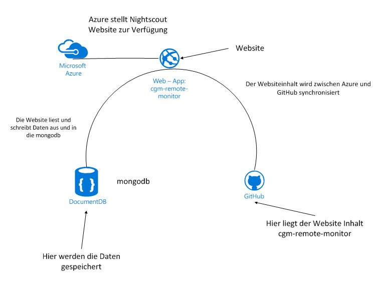

.. _Nightscout:

Nightscout
==========

Nightscout besteht aus **3 Komponenten**:

-  Einer Dokumentations-Datenbank (MongoDB) zur Speicherung von
   Blutglukose, Kohlenhydraten, Insulin, Aktivitäten usw. MongoDB ist
   eine Cloudanwendung und kann über das Internet erreicht werden.

-  Einer **Web-Applikation**, welche über einen beliebigen Browser oder
   eine App aufgerufen werden kann. Die Anwendung wird in einem
   Verzeichnis aktualisiert, welches über einen webbasierten Filehosting
   Dienst `GitHub <https://github.com/>`__ verwaltet wird. Dieser
   Dienst ist grob vergleichbar mit Webdiensten wie z.B. Google Docs.
   Die Grundidee dabei ist, anderen ein Verzeichnis mit Dateien zur
   Verfügung zu stellen, damit man gemeinsam daran arbeiten kann.
   Nightscout besteht aus vielen Plugins zur individuellen
   Konfiguration. Die Plugins mit Parametern sind im Kapitel
   :ref:`Nightscout_Plugins` 
   beschrieben.

-  Einem Cloud-Service Anbieter, welcher die Web-Applikation über
   Webserver zur Verfügung stellt. Microsoft
   `Azure <https://azure.microsoft.com/de-de/pricing/free-trial/>`__
   oder `Heroku <https://www.heroku.com/>`__ können hierfür
   verwendet werden. Cloud-Service Anbieter betreiben weltweit
   Rechenzentren, man konfiguriert webbasiert wie hier Nightscout
   diese Dienste. Das Hosting ist hier nicht zwingend notwendig,
   eigene standalone - Lösungen bei einem entspr. Provider sind auch
   möglich.

Wir können Azure auf verschiedene Weisen einrichten:

**Geführte Installation:**

Die Nightscout Website lässt sich fast vollkommen automatisiert
einrichten. Dieses sowohl mit **Azure** als auch mit **Heroku** als
Provider. Dieses ist in Kapitel 
:ref:`deploy-azure`
beschrieben.

**Lokale Installation:**

Nightscout lässt sich auch lokal, z.B. auf einem Rasberry PI
installieren. Dieses hat den Vorteil, das keine Internetverbindung zum
Auslesen von Daten erforderlich ist. Die mongodb, ein Webservice und
die Website müssen dazu installiert und konfiguriert werden. Dieses
ist in Kapitel *Lokale Installationen* beschrieben. Es steht am Anfang 
und wird weiter bearbeitet.

**Klassisch:** Die klassische Einrichtung erfordert das manuelle
Anlegen der Azure Website mit allen Einstellungen. Dieses ist in Kapitel
*Azure* beschrieben.

Ein Schaubild verdeutlicht die Zusammmenhänge:

|nightscout scheme|

**Contents:**

.. toctree::
   :maxdepth: 6

   
   account_sheet
   mongo_db
   github
   azure
   deploy_azure
   azure_plugins
   nightscout_website
   lokale_installationen
   programmierbarkeit
   
   
