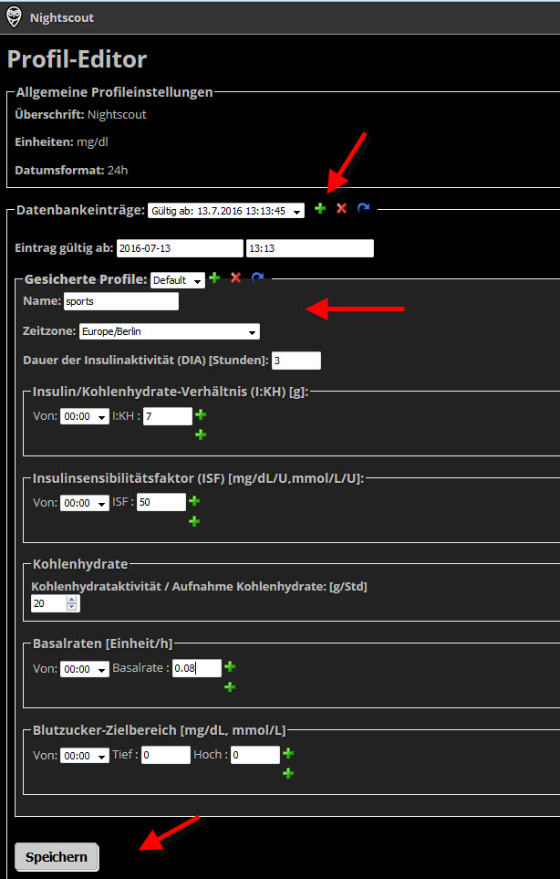
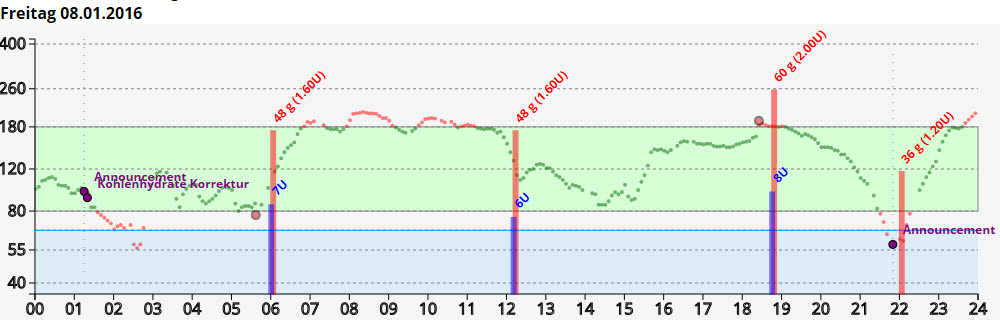
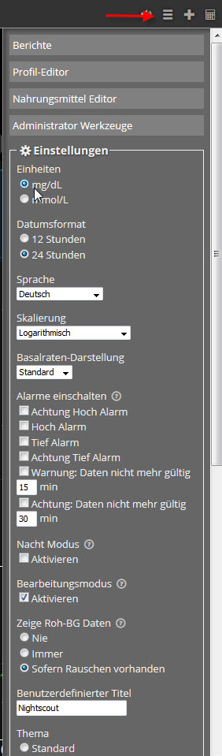
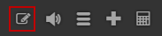

.. _Die Nightscout Website:

Die Nightscout Website
======================

Die Nightscout Website ist die zentrale Website zur Darstellung und
Speicherung von Diabetes - Daten. Sie kann als komplettes Tagebuch mit
Eingabe von Insulin, Kohlenhydraten, Bewegung uvm. verwendet werden.
Mit der Integration von **OpenAPS** wird der gesamte Verlauf der
Pumpensteuerung mit temporären Basalraten dargestellt. Der gesamte CGM
- Verlauf wird online dargestellt und zyklisch aktualisiert. Es gibt
umfangreiche
`Einstellungsmoeglichkeiten <../nightscout/settings.md>`__ für die
Website Das `Behandlungsportal <nightscout/care_portal.md>`__ bietet
eine umfängliche Auswahl an Behandlungsdaten. Über den `Bolus
Rechner <nightscout/boluscalculator.md>`__ können für Mahlzeiten
abzugebende Boluseinheiten berechnet werden.

Das `Reporting <../nightscout/settings.md>`__ bietet die Möglichkeit,
die Daten auszuwerten und für andere zur Analyse auszugeben. Mit dem
`Profileditor <../nightscout/settings.md>`__ hat man die Möglichkeit,
Parameter in unterschiedlichen Profilen abzuspeichern, die z.B. für
die Pumpensteuerung benötigt werden. Die Grafik wird standardmäßig
alle 60 Sekunden aktualisiert.

Möchte man sich die FGM/CGM - Werte anzeigen lassen, so sind die
Einstellungen zum Übertragen der Daten in der Uploader-App
(`Xdrip <../grundlagen/xdrip/xdrip_app.md>`__, NightScout-Uploader oder
Glimp) erforderlich.

Ein Beispiel für eine mögliche Anbindung eines CGM Systems an die
Nightscout Website:

**Kommunikation:**

|nightscout_principle|

Wir schauen uns zunächst die `Haupt Seite <nightscout/main_page.md>`__
an.

Haupt Seite
-----------

Nightscout ist seit Oktober 2016 in der Version **0.9** - **Grilled
Cheese** verfügbar. Wer Vorgängerversionen nutzt, muss Einstellungen für
die Website in Azure oder Heroku überprüfen und ergänzen.

Variable unter den App - Einstellungen zum Hinzufügen:
``AUTH_DEFAULT_ROLES`` mit ``readable``, ``status-only`` als mögliche
Werte.
devicestatus-Upload

Wenn wir die Website aktualisieren und feststellen, dass Dinge, die wir
aktiviert haben, nicht richtig angezeigt werden (wie boluscalc), bitte
folgendes überprüfen:

**Bitte Sicherstellen, dass es nur eine die ENABLE - Zeile in den
gesamten Einstellungen der Website gibt. (Das bedeutet nur ein einziges
Mal in den Gesamteinstellungen, einschließlich App-Einstellungen und
Verbindungszeichenfolgen.)
Wenn ENABLE in Connection Strings auftaucht , bitte in die App Settings
verschieben. Speichern nicht vergessen und anschließend die Website
Stoppen und Starten.**

**Grilled Cheese** benötigt ein **Profil**

Wenn wir zuvor kein Profil auf der Website eingerichtet haben, werden
wir beim ersten Aufruf der Website aufgefordert,ein Profil zu erstellen.
Wir können alle Informationen eingeben, oder nur die Zeitzone (und das
Profil später bearbeiten). Wir müssen die Website authentifizieren,
bevor wir die Profiländerungen speichern können. Um sich zu
authentifizieren, verwenden wir den Link am unteren Rand des Profils
Bildschirms und geben das **API SECRET** ein. Sobald wir authentifiziert
sind, ändern wir das Profil und klicken dann auf **Speichern**. Wenn das
Profil korrekt gespeichert ist, sehen wir **Erfolg** unten und rechts
oben. Wir können nun die Website öffnen.

Wir sehen uns nun die **Hauptseite:** an. Die Grafik wird alle 60
Sekunden aktualisiert.

|nightscout_base_site|

Was sehen wir ?

#. Zeit seit der Letzten CGM Sensor - Daten - Übertragung
#. Batterie - Ladezustand des Smartphones
#. Plugins für die Pumpensteuerung
#. Zeitrahmen der Darstellung von Behandlungsdaten
#. aktueller BZ - Wert
#. Trendpfeilangabe
#. Zunahme/Abnahme des BZ innerhalb von 2 Messpunkten
#. Plugins mit Anzeige von Werten wie ``Sensor - Alter`` ,
   ``Insulin on Board``
#. Basalratenverlauf
#. CGM - Meßwerte
#. Behandlungsdaten Kohenhydrate - und Insulineinheiten
#. BZ - Trend - Voraussage
#. Zeitfenster der Darstellung im oberen Bereich

In der rechten oberen Ecke finden wir **Menü - Auswahlfelder**.

|Menüpunkte|

**Bearbeitungsmodus**

``EDIT_MODE`` (``on``) - mögliche Werte ``on`` oder ``off``. Wenn diese
Option aktiviert ist (rot) , kann man z.B. Behandlungsdaten grafisch mit
der Maus bearbeiten, indem man eingegebene Werte auf der Zeitachse
verschiebt.

Mit dem **Lautsprecher** - Symbol kann man eingestellte Alarme testen.

Das Symbol mit den **3 Strichen** ist das Einstellungsmodul mit
umfangreichen Möglichkeiten.

Mit dem Klick auf das **+** - Symbol rufen wir das **Behandlungsportal**
auf.

Mit dem **Taschenrechner** - Symbol gelangen wir zum **Bolus -
Rechner**.

Um die Website weiter anzupassen rufen wir jetzt das
`Einstellungen <../nightscout/settings.md>`__ Menü auf.

Einstellungen
-------------

Die **Einstellungen** für die Website erreichen wir mit dem Klick auf
das mit dem **roten** Pfeil markierte Symbol:

**Oben** haben wir die Wahl von 4 Menüpunkten:

-  `Berichte <../nightscout/settings.md#berichte>`__
-  `Profil - Editor <../nightscout/settings.md#profil---editor>`__
-  `Nahrungsmittel
   Editor <../nightscout/settings.md#nahrungsmittel-editor>`__
-  `Administrator
   Werkzeuge <../nightscout/settings.md#administrator-werkzeuge>`__

**Unten** sind die Browsereinstellungen gelistet. Wenn wir diese zentral
für alle Browser gleich halten wollen, können wor dieses wie in Kapitel
`Nightscout Plugins <../nightscout/azure_plugins.md>`__ beschrieben,
umsetzen.

|Einstellungen|

Reports
~~~~~~~

Wir starten das **Reporting** mit dem Klick auf **Berichte** und
erhalten diese Ansicht:

|nightscout_reporting_config|

Die **Report - Arten** sind umfangreich. Wir können sie uns mit Klicks
auf den Namen aufrufen.

Mit der Eingabe der **Zeiträume** bestimmt man den Report - Umfang.
Wir können vorgefertigte Zeiträume und individuelle Zeiträume
auswählen. Weitere Filter sind möglich.

Wir starten die Ausgabe des Reports mit dem Klick auf **Zeigen**.

Mit dem Report **Von Tag zu Tag** gibt es alle Daten auf einen Blick:

|nightscout_reporting_daily_graph|

Wir haben auch die Möglichkeit, eingegebene Werte mit dem Klick auf
**Bearbeitung** zu **Korrigieren** oder zu **Löschen**:

|nightscout_change_treatments|

Profil - Editor
~~~~~~~~~~~~~~~

Der Behandlungs Profil Editor speichert angepasste Werte für die
persönliche Therapie.Mit dem Profil - Editor konfigurieren wir Einheiten
und Werte für Plugin iob, cob, bwp und Basalraten.

Über einen eneuen Datenbankeintrag durch Klicken auf das + - Symbol
können wir ein alternatives Profil erstellen. Der NS android Client
zur Steuerung der Kommunikation zwischen Pumpe und CGM erfragt Werte
aus den abgespeicherten Profilen.

**Wichtig:** Ohne Änderugen im Editor werden für die Plugins keine
verwendbaren Werte angezeigt. Seit Grilled Cheese, Version 0.9 ist das
Anlegen eines Profils beim ersten Aufruf der Website erforderlich.

|nightscout_profile_editor_plugins|

Wenn wir die Maus oder den Finger über Fachbegriffe bewegen, werden
**Erklärungstexte** in deutscher Sprache angezeigt sofern Nightscout auf Deutsch eingestellt wurde.

Bei **Zeitzone** bitte die entsprechende Zeitzone Einstellen.

Mit **Dauer der Insulinaktivität (DIA) in Stunden** definieren wir die
Wirkdauer des Bolus - Insulins. Die Plugins iob, bwp benötigen diese
Eingaben.

Mit **Insulin/Kohlenhydrate-Verhältnis (I:KH) in Gramm** wird angegeben,
wieviel Boluseinheiten für eine definierte Menge an KH verwendet werden
müssen. Die Plugins iob und cob benötigen diese Eingaben.

Mit dem **Insulinsensibilitätsfaktor (iSF) in mg/dl/U oder mmol/L/U**
können wir den Korrekturfaktor in mg/dl oder mmol/L angeben. Mit
mehrfachen Eingaben können unterschiedliche Faktoren bestimmt werden.

Mit **Kohlenhydrataktivität / Aufnahme Kohlenhydrate in Gramm/Stunde**
können wir bestimmen, wieviel Gramm Kohlenhydrate pro Stunde
verstoffwechselt werden. Das Plugin cob benötigt diese Eingaben.

Mit **Basalraten in Einheiten/Stunde** können wir Basalraten für
bestimmte Zeitbereiche eingeben.

Am Ende das **Speichern** nicht vergessen.

Nahrungsmittel Editor
~~~~~~~~~~~~~~~~~~~~~

|nightscout_nahrungsmittel_editor|

Im Nahrungsmittel - Editor können wir Mahlzeiten Mit Angabe von
Bezeichnung , Kategorie und Kohlenhydraten. Daten sind für den **Bolus
Kalkulator** optional wählbar. Über Ernährungsprogramme lassen sich die
Daten über csv- oder json - Format in die **mongodb** übertragen.

#. Eingabe von Nahrungsmittel - Daten
#. Ändern, Löschen von Datensätzen

Administrator Werkzeuge
~~~~~~~~~~~~~~~~~~~~~~~

|nightscout_administrator_werkzeuge|

Mit den Administrator - Werkzeugen können wir Berechtigungen zum Zugriff
auf die Nightscout - Website verwalten und Datensätze aus der mongo DB
löschen.

Verwalten von Berechtigungen
^^^^^^^^^^^^^^^^^^^^^^^^^^^^

Für Berechtigungen benötigt man **Subjekte** (Menschen, Institutionen,
etc.), denen man eine Rolle zuweist. Für jedes Subjekt wird ein
**Zugriffstoken** generiert, mit dem der Betrachter Zugriff auf die
Website bekommt. Dieses Token muss man dem Betrachter mitteilen.
Innerhalb der Rolle werden Zugriffsberechtigungen verteilt, das höchste
Recht ist Vollzugriff, symbolisiert durch ein ``*``- Symbol, das
niedrigste ist **kein Zugriff**.

#. Anlegen von Subjekten
#. Anlegen von Rollen
#. Löschen von Dokumenten
#. Behandlungsdaten in der Zukunft

Anlegen von Subjekten:

|nightscout_subjects|

Es gibt standardmäßig 6 Rollen, die in den meisten Fällen ausreichend
sind. Hinter den Rollen sind die Zugriffsrechte gelistet.

Man kann eigene Rollen wie beim anlegen von Subjekten definieren und
speichern.

Es ist unter Punkt 3 möglich, die Gerätestatus - Sammlung (Collection in
der mongo db) mit diesem Menüpunkt zu löschen.

Mit Punkt 4 kann man fälschlicherweise Behandlungen mit Datum in der
Zukunft aus der Datenbank löschen.

Behandlungsportal
-----------------

Wir beschäftigen uns hier genauer mit der Dateneingabe und starten mit
dem Klick auf das ``+`` - Symbol. Der Ereignis-Typ ist ein DropDown -
Menü mit Auswahlwerten. Bespielhaft wählen wir jetzt einen
``Mahlzeiten Bolus`` aus, um Insulinmenge und Kohlenhydrate (KH)
hinzuzufügen.

**Ereignis-Typ:**

|nightscout_careportal|

Die Auswahlfelder werden entsprechend der Auswahl angepasst.

Eingabe von KH und Insulineinheiten erfolgen jetzt. Wichtig ist auch
noch die Eingabe der

korrekten **Zeit**, falls man Daten nicht online eingeben kann, da
diese zusammen mit den CGM - Werten grafisch dargestellt werden.

In dieser Maske können wir auch temporäre Basalraten mit
``Temp Basal Start/End`` eingegeben. Diese werden anschließend
grafisch dargestellt.

Nach dem Klick auf **Eingabe Senden** wird man noch aufgefordert, die
eingaben zu bestätigen. Mit **OK** ist alles gespeichert.

Nun können wir uns alles grafisch ansehen:

|nightscout_cp_entries|

**Benachrichtigungen** über Therapie - Behandlungsdaten

Wenn Benachrichtigungen über Behandlungsdaten aktiviert sind, werden
Benachrichtigungen generiert wenn eine Eingabe im Careportal gemacht
wurde. Mögliche Alarmeinstellungen werden kurz danach unterdrückt. Die
Standard - Unterdrückungsdauer beträgt 10 Minuten. Dieses kann über
Azure App.-Einstellungen geändert werden, in dem man die
TREATMENTNOTIFY\_SNOOZE\_MINS
Variable ändert.

Bolus Rechner
-------------

Der Bolus Rechner berechnet die abzugebende Insulinmenge für eine
Mahlzeit. Wir erreichen das Menü durch Klick auf das Rechner - Sysmbol
ganz oben rechts:

|Bolus Rechner|

Die KHs können entweder manuell oder über gespeicherte Mahlzeiten aus
der Nahrungsmittel - Tabelle eingegeben werden.

Der Bolus Rechner greift auf Werte aus dem ``Profil Editor`` zu,
genauer dem ``ISF`` und dem ....

mit ``Formular absenden`` werden die Daten gespeichert.

.. |Bolus Rechner| image:: ../images/nightscout/nightscout_bolus_calculator.jpg
.. |nightscout_careportal| image:: ../images/nightscout/nightscout_careportal.jpg
.. |nightscout_cp_entries| image:: ../images/nightscout/nightscout_cp_entries.jpg

.. |nightscout_reporting_config| image:: ../images/nightscout/nightscout_reporting_config.jpg

.. |nightscout_change_treatments| image:: ../images/nightscout/nightscout_change_treatments.jpg

.. |nightscout_nahrungsmittel_editor| image:: ../images/nightscout/nightscout_nahrungsmittel_editor.jpg
.. |nightscout_administrator_werkzeuge| image:: ../images/nightscout/nightscout_administrator_werkzeuge.jpg
.. |nightscout_subjects| image:: ../images/nightscout/nightscout_admin_tools_subject.PNG
.. |nightscout_base_site| image:: ../images/nightscout/nightscout_base_site.jpg

.. |nightscout_principle| image:: ../images/nightscout/nightscout_principle.jpg

