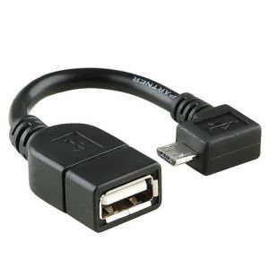
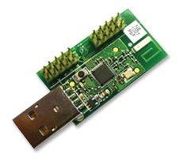

# Hardwarevoraussetzungen

Um den MMCommander zu bauen wird folgende Hardware benötigt:

ein "geeignetes" **Android Smartphone** mit USB OTG Unterstützung. Ob ein bereits vorhandenes Smartphone geeignet ist, lässt sich leider nicht sicher vorhersagen. Als Orientierung kann man sich auf [www.nightscout.info](www.nightscout.info) eine Liste mit bestätigten Smartphones ansehen: ([Liste](http://www.nightscout.info/wp-content/uploads/2015/02/Nightscout-OTG-Database_CGMitC.xlsx.pdf)). Zusätzlich gibt es eine Liste mit Smartphones, die laut Nightscout.info **nicht** funktionieren:

 
* 
Kyocera Hydro 
* 
Samsung Mini – alle Modelle
* 
Moto E
* 
Straight Talk LG L34C Optimus Fuel
* 
LG Realm
* 
Geräte mit **Blackberry** Betriebssystem
* 
Geräte mit **iOS** Betriebssystem (Apple - Geräte)
* 
HTC Desire (außer AT&T Version)
* 
Core Prime
* 
Droid Bionic
* 
Droid Razr Maxx
* 
Droid Razr

zusätzlich zu den Infos der Nightscout-Seite habe ein HTC One (M7) mit Android 5.1 "Lollipop" ausprobiert. Dieses schien zunächst zu funktionieren, leider empfing der MMCommander mit diesem Smartphone immer nach unterschiedlich langen Zeiten keine Daten der Pumpe mehr, so dass diese Konfiguration leider nicht funktionierte. Erfolgreich läuft der MMCommander derzeit mit meinem Sony Xperia Z3 - ebenfalls mit Android 5.1 "Lollipop". Dieses Smartphone hat den Vorteil, dass man es über einen weiteren magnetischen Anschluss laden kann, während die Micro USB Buchse durch den MMCommander blockiert ist. Im Internet scheinen sich übrigens viele Nightscout-Benutzer sich für das kostengünstige Motorola Moto G entschieden zu haben.  

ein **USB-OTG Kabel** (Micro-USB Stecker  auf normale USB  Buchse) - zumeist empfiehlt es sich einen gewinkelten USB-Stecker zu nehmen, wobei die Richtung vom verwendeten Smartphone abhängt. Man findet eine relativ große Auswahl bei Ebay oder Amazon. Die Kosten betragen etwa 5 €.

einen **CC1111 USB Dongle**, diesen Funk-Sender-Empfänger kann man z.B. für etwa 75 $ hier bestellen: http://www.ti.com/tool/cc1111emk868-915 oder für 67 € hier:
http://de.farnell.com/texas-instruments/cc1111emk868-915/cc1111-rf-transceiver-eval-module/dp/2334589.

zumindest einmalig zum Programmieren des CC1111 USB Dongles einen **CC Debugger**. Dieser kann für rund 49 $ ebenfalls z.B. unter http://www.ti.com/tool/CC-DEBUGGER bestellt werden oder für 44 € hier: http://de.farnell.com/texas-instruments/cc-debugger/prog-debugger-f-rf-soc/dp/1752232?MER=baynote-1752232-pr.

