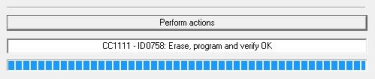

# CC1111 Programmierung

Um den CC1111 USB Dongle zu programmieren, muss der SmartRF Flash Programmer entsprechend konfiguriert werden. Im "System-on-Chip" Fenster sollte nun der CC1111 erscheinen. Im "Flash image" Fenster auf den Button mit den drei Punkten drücken und die bereits heruntergeladene HEX-Datei auswählen (MMCommander_EUR_0.89_NoTx.hex). Bei den "Actions" wählt man den Punkt "Erase, program and verify" aus.

Anschließend nur noch auf "Perform actions" klicken und kurz warten. Hat alles geklappt, sollte es so aussehen:

