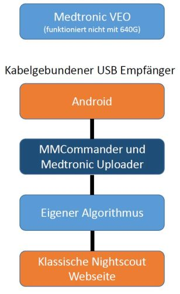

# MiniLink Transmitter

Mit dem MiniLink Transmitter und der Medtronic Veo Insulinpumpe gibt es eine von Nightscout veröffenlichte Möglichkeit die Daten zur Nightscout Webseite zu bekommen.

Danach stehen einem die in den Kapiteln 3 [Die Nightscout Hauptseite](../nightscout/die_nightscout_website.html) und 4 [Smartwatch Integration](../smartwatch/smartwatch_integration.html) genannten Möglichkeiten zur Verfügung.

Um das zu Realisieren muss man den MMCommander bauen und mit der entsprechenden Software bespielen. Zusätzlich muss noch auf einem kompatiblen Android Smartphone die Medtronic Uploader App installiert und konfiguriert werden. Beides ist im Kapitel 

