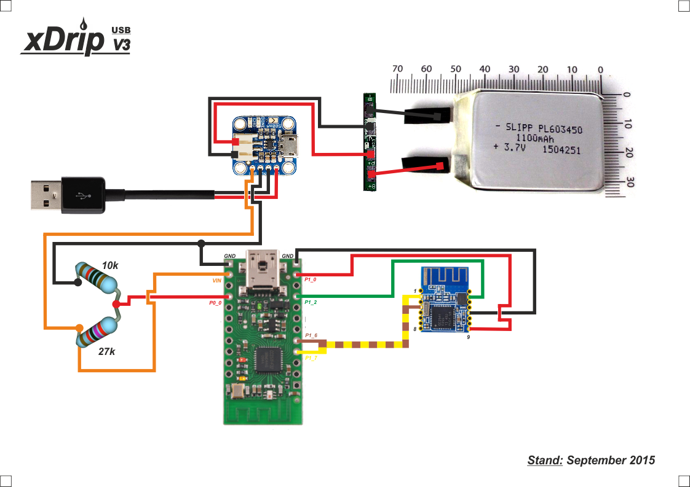

# Bausatz
Es gibt verschiedene Möglichkeiten, um die Hardware für einen xDrip zu bauen. (Verschiedene Hardware und verschiedene Varianten, die selbe Hardware miteinander zu verlöten.) Ein Bauteil, das bei jeder HW-Variante benötigt wird, ist eine Platine, die "Wixel" genannt wird. Für diese Platine gibt es unterschiedliche Software. 
Das ist der Grund dafür, warum es unterschiedliche Anleitungen und verschiedene Namen für sehr ähnliche Dinge gibt.
Die Varianten haben unter schiedliche Eigenschaften, letztlich aber die selbe Aufgabe: Daten vom Transmitter empfangen und an ein Bluetooth-Handy übertragen.

Solange man keine vollständige Übersicht über die Komponenten und deren Funktion hat, empfehle ich, sich eine der verfügbaren Anleitungen zu nehmen und dieser zu folgen. 

## 
Tipps und Rat für Einsteiger: 
* Baut zunächst einen xDrip in der "klassischen Verschaltung" mit xBridge2.wxl auf dem Wixel. Es entfallen die beiden Widerstände, dafür fehlt später in der App die Batterieanzeige. Wenn das später gewünscht ist, kann man diese Teile problemlos nachrüsten.
* Große Akkus bringen (natürlich) eine längere Laufzeit. Es kann aber sein, dass ein großer Akku den Empfang der Antennen verschlechtert.
* Die Brücke "for faster charging with large batteries" beeinflusst den Ladestrom. Ist die Brücke geöffnet, fließen 100 mA. Wird sie geschlossen, fließen 500 mA. Ein kleinerer Ladestrom schont den Akku - aber die Ladezeit erhöht sich. Der Hersteller empfiehlt die Brücke für Akkus ab 500 mAh zu schließen.
* Die Kabel können sehr dünn sein - das erhöht die Flexibilität. Verschiedene Farben machen es leichter, die Übersicht zu behalten, solange der xDrip noch im Bau ist. 
* Das Schutzmodul für Lipo-Akkus (unten in der Stückliste mit Nr. 2) hat sich in einem Fall nicht bewährt: Es gab fortwährendes Ein- und Ausschalten. Das könnte am kleinen Akku gelegen haben. Evtl. war es aber Pech oder fehlerhaft verlötet - das will ich nicht ausschließen. (Im Prinzip ist das sicher sehr sinnvoll. Es geht aber auch ohne, wenn man zu häufige Tiefentladung anders vermeidet.)
* In den Schaltbildern sind keine Schalter eingetragen. Ich nutze einen Schalter für folgende Anwendungen: Ich habe stets einen zweiten (geladenen, aber abgeschalteten) xDrip als Ersatz dabei. Wenn ich z.B. schwimmen gehen, schalte ich den xDrip ab.

**Schaltbild für xDrip in der "klassischen Verschaltung"**

(ohne Widerstände für Batterieanzeige)

Empfohlene Links:
* http://circles-of-blue.winchcombe.org/index.php/2015/01/11/wearenotwaiting-thanks-to-dexdrip-introduction/
* https://github.com/StephenBlackWasAlreadyTaken/wixel-xDrip
* http://stephenblackwasalreadytaken.github.io/xDrip/

Anleitung zum Löten:
* https://www.youtube.com/watch?v=YuxCUeJ9xAU&feature=youtu.be

Zum Aufspielen der Software auf das Wixel:
* [Wixel Configuration Utility](https://www.pololu.com/product/1337/resources)
 

---
## 
---
** Stückliste - "xDrip V3 USB"** ( Stand: September 2015 )

|Nr.| Bemerkung| Bauteil: | Vertrieb: | Verkaufspreis: | Artikelnummer: | Hersteller-Nr.: | EAN: |
| -- | -- | -- | -- | -- | -- |
|1| optional|[IC Lithium-Polymer Akku-Schutzschaltung](http://www.voelkner.de/products/128243/IC-Lithium-Polymer-Akku-Schutzschaltung.html) | Voelkner |2,96 € | Q33939 | S-8261ABJMD-G3J2G |2050000662089 |
|2| optional (und Alternative zu 1)|[Schutzmodul für Lithium-Polymer-Akkumulator S-8261ABJMD-G3J2G](https://www.conrad.de/de/schutzmodul-fuer-lithium-polymer-akkumulator-s-8261abjmd-g3j2g-gehaeuseart-aufgebaute-platine-ausfuehrung-schutzmodul-fuer-lithium-polymer-akkumulator-155151.html?ref=searchDetail) | Conrad | 2,96 € | 155151 - VQ | S-8261ABJMD-G3J2G | 2050000662089 |
|3| notwendig|[Pololu Wixel Programmable USB Wireless Module](http://www.exp-tech.de/pololu-wixel-programmable-usb-wireless-module)| EXP TECH | 18,60 € | EXP-R25-070 | Pololu  1337 |  |
|4| notwendig| [Adafruit Mini Lipo w/Mini-B USB Jack - USB LiIon/LiPoly charger](http://www.exp-tech.de/adafruit-mini-lipo-w-mini-b-usb-jack-usb-liion-lipoly-charger) | EXP TECH | 7,65 € | EXP-R15-446 | Adafruit  1905 |  |
|5| notwendig, alternativ auch HM10 möglich |[Seeed Studio Bluetooth V4.0 HM-11 BLE Module](http://www.exp-tech.de/seeed-studio-bluetooth-v4-0-hm-11-ble-module) | EXP TECH | 12,28 € | EXP-R02-308 | Seeed Studio  210005001 |  |
|6| optional|[ Handgehäuse Minitec El, 78x48x20, Lava/Grün](http://www.voelkner.de/products/213275/Minitec-El-78x48x20-Lava-Gruen.html) | Voelkner | 12,38 € | S23261 | D9006178 | 2050001140593 |
|7| optional |[Hand-Gehäuse Kunststoff Lava, Grün 78 x 48 x 20 OKW D9006178 1 Set](https://www.conrad.de/de/hand-gehaeuse-78-x-48-x-20-kunststoff-lava-gruen-okw-minitec-d9006178-1-set-535384.html?ref=searchDetail) | Conrad | 13,57 € | 535384 - 62 | D9006178 | 2050001140593 |
|8| notwendig, oder ein anderer 3,7v LiPo-Akku | [Lipo Akku 1100 mAh 3,7V Einzelzelle](http://shop.lipopower.de/1100-mAh-37V-Einzelzelle-1C-34mm-breit)  | Lipopower.de | 6,95 € | 7.011.0-11_34 | 1C 603450 |  |
|9| optional, für Batterieanzeige| Metallschichtwiderstand 10k |  |  |  |  |  |
|10| optional, für Batterieanzeige| Metallschichtwiderstand 27k |  |  |  |  |  |
|11| notwendig |Farbige flexible Leitungen (dünn) |  |  |  |  |  |
|12| notwendig| Lötzinn, Lötkolben |  |  |  |  |  |
|13| optional, aber emfpehlenswert| Schrumpfschlauch |  |  |  |  |  |
|14| optional, aber emfpehlenswert| "dritte Hand" ein Beispiel: [Link](http://www.amazon.de/Silverline-633830-Dritte-Hand-Lupe/dp/B000O3RJFC/ref=sr_1_4?ie=UTF8&qid=1453657700&sr=8-4&keywords=dritte+hand) |  |  |  |  |  |
|15| optional | Epoxid Trennschicht |  |  |  |  |  |

**Schaltbild für "xDrip USB V3"**

