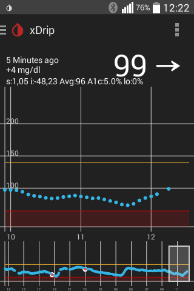

# xDrip App

Die xDrip-App ist eine Anwendung (eine App), die auf einem Android-Handy läuft. Sie dient dazu CGM-Werte auf dem Mobiltelefon und einer Smart-Watch anzuzeigen, auszuwerten und bei Bedarf zu NightScout hochzuladen.
Um die Werte zu erhalten, benötigt man entweder ein Dexcom G4 *with Share* oder einen selbstgebauten Bausatz. Da *Share* in Europa nicht erhätlich ist, beschränkt sich dieses Handbuch auf den Bausatz.

##Voraussetzungen:
1. Android-Telefon mit Betriebssystem-Version 4.3 (besser 4.4 oder höher)
2. Bluetooth-Low-Energy (BLE)-Funktionalität. Diese ist in der Regel ab Bluetooth 4.0 vorhanden.
3. xDrip-Bausatz (s. Kapitel Bausatz) oder Dexcom-Share-Receiver (nur USA)

---
##Screenshots:
Hauptansicht - alle 5 Minuten ein Wert 

---

## Grund-Funktionalität:
### Download & Installation
Die xDrip-App wird derzeit (Stand 01/2016) noch häufig angepasst. Der Download für eine lauffähige Version (*.apk-File) findet sich hier: [Link zur Beta-Version](https://github.com/StephenBlackWasAlreadyTaken/xDrip/wiki/xdrip-beta)

Die hier verlinkten Versionen sind so erstellt, dass man eine ältere Version mit einer neueren updaten kann, ohne Einstellungen und Messwerte zu verlieren.
Wer hinreichende technische Kenntnisse hat, kann sich aus den Sourcen selbst die apk kompilieren. 

### Verbinden mit dem Wixel: Bluetooth-Scan / Hardware data source
### Starten des Sensors
### Kalibrieren
### Alarme
#### BG-Level-Alerts
#### BG-Alert-Settings
##### Profil: High, Ascending, ...
##### Smart snoozing/alerting: Empfehlung am Anfang diese zu deaktivieren.
#### Rise-Fall-Alerts
#### Calibration Alerts

## Verbinden mit einer Smartwatch:
An dieser Stelle wäre es möglich, die Daten direkt an die Smartwatch zu senden. Damit könnte man die Installationsschritte in "Nightscout einrichten" umgehen. Damit wiederherum umgeht man aber auch die Möglichkeit, die Daten weiter zu nutzen. (Als Überwachungsfunktion, als Tagebuch oder für das APS)
### Android Wear
### Pebble

## Upload zu NightScout:

## Weiteres:
### Settings
|Name|Bedeutung|Empfehlung für Einsteiger|
|--|--|--|
|Bg Untis| "mg/dl" oder "mmol"| -|
| High Value | Grenze, ab der ein Wert in der Anzeige und Statistik als "zu hoch" gewertet wird. | -|
| Low Value | Grenze, ab der ein Wert in der Anzeige und Statistik als "zu tief" gewertet wird. | -|
|...|
| Display Brdige Battery| Sofern ein Spannungsteiler eingebaut wurde, kann eiene Batterie-Anzeige gemacht werden| Nur aktivieren, wenn ein Spannungsteiler verbaut wurde.|
| Run Collectoin Service in foreground| Klärung nötig: Kann das die BT-Verbindung tatsächlich verbessern? Zeigt in den Statusmeldungen und ggf. im Lockscreen den Wert mit Tendenz an.| aktivieren |
### Widgets
### Werte vorlesen lassen
### Statistik
### Transmitter-Batterie-Info
### xBridge-Batterie-Info
### Interne Daten (Datatables + Calibration Graph)

	

