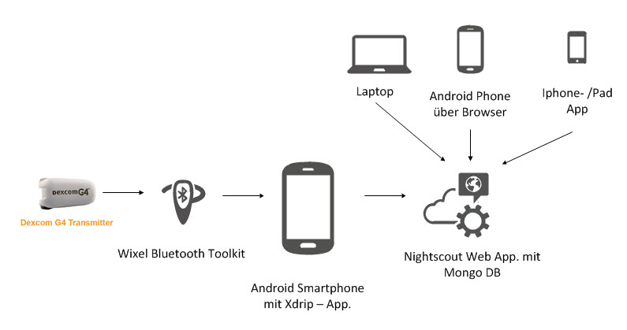

# Die Nightscout Website

Die Nightscout Website ist die zentrale Website zur Darstellung und Speicherung von Diabetes - Daten. Sie kann als komplettes Tagebuch mit Eingabe von Insulin, Kohlenhydraten, Bewegung uvm. verwendet werden. Der gesamte CGM - Verlauf wird online dargestellt und zyklisch aktualisiert. Es gibt über Plugins umfangreiche Konfigurationsmöglichkeiten.
Das Reporting bietet die Möglichkeit, die Daten auszuwerten und für andere zur Analyse auszugeben.

Die derzeitige Version des cgm-remo

Möchte man sich die FGM/CGM - Werte anzeigen lassen, so sind die Einstellungen zum Übertragen der Daten in der Uploader-App ([Xdrip](../grundlagen/xdrip/xdrip_app.md), NightScout-Uploader oder Glimp) erforderlich.

Ein Beispiel für eine mögliche Anbindung eines Dexcom CGM Systems an Nightscout:

**Kommunikation:**

Wir starten mit der [Haupt Seite](../nightscout/haupt_seite.md):

