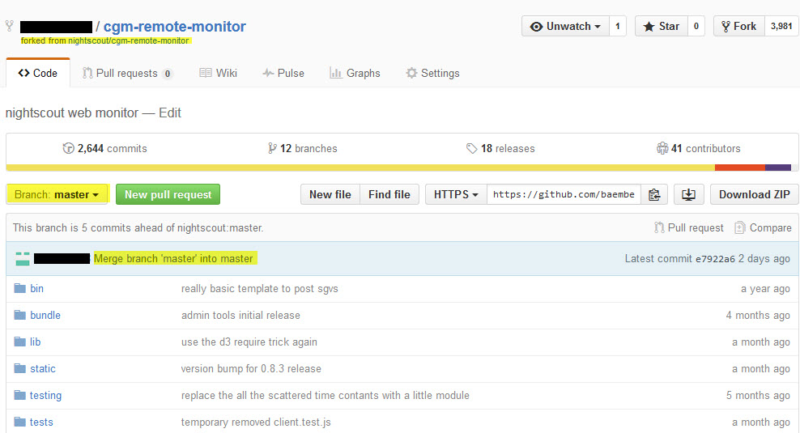
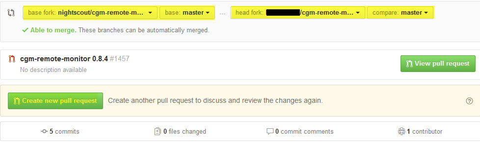

# GitHub

[GitHub](https://de.wikipedia.org/wiki/GitHub) ist ein webbasierter Filehosting-Dienst für Software-Entwicklungsprojekte. Software besteht aus vielen Files, die in einer Verzeichnisstruktur liegen. Diese Files enthalten den eigentlichen Programmiercode. 
Stellt ein Software - Entwickler etwas zur Verfügung, steht es für andere als **master**
zur Verfügung, wie z.B. der `nightscout/cgm-remote-monitor`. Diees Files kopiert man sich in sein eigenes Verzeichnis (Fork). Der cgm-remote-monitor enthält den Programmcode zum Aufbeu der Nightscout Website.

Wir starten mit dem **Sign Up** auf der [GitHub Site](https://github.com/):

**Wichtig** ist auch hier, Benutzername und Passwort in das Datenblatt einzutragen.

Mit **Edit Profile** können wir uns unsere Einstellungen ansehen. 

**Billing:**

 Unter diesem Menüpunkt sind die Kosten aufgelistet, wichtig ist hier, das hier **Free** angezeigt wird:
 
 
 
 Wir suchen jetzt den **Programmcode**:
 
  Über die Suchfunktion jetzt cgm-remote-monitor eingeben:
 
 
 
 Und mit **Fork** kopieren wir den Code in unser eigenes Verzeichnis:
 
 
 
 Das Ergebnis mit unserem eigenen **master** Branch:
 
 
 
 
 
 
 
 **Aktualisierung des cgm-remote-monitors**
 
 Die Nightscout Website wird ständig weiterentwickelt. Diese Weiterentwicklung hat als Kennzahl die **Version**. Stand Januar 2016 hat der cgm-remote-monitor die Version 0.8.4.
 Diese ist hinterher auch auf der [Nightscout Website](https://ladyviktoria.gitbooks.io/nightscout_handbuch/content/nightscout/haupt_seite.html) hier zu sehen:
 
 Bild einfügen !!!!!!!!!!
 
 Der Progammcode muss dafür synchronisiert werden. nightscout/cgm-remote-monitor enthält aktuellere Daten als die im eigenen Verzeichnis (Branch). 
 
Wir setzen dieses mit einem **New pull request** um werden hierhin weitergeleitet:

 Jetzt einen Namen eingeben und nochmals mit **Create pull request** bestätigen.
 
 GitHub vergleicht jetzt den Inhalt und die File - Versionen und aktualisiert im eigenen
 Verzeichnis ältere Versionen.
 
 
 
 
 Jetzt geht es weiter mit dem Einrichten von [Azure](https://ladyviktoria.gitbooks.io/nightscout_handbuch/content/nightscout/azure.html).
 
 
 

