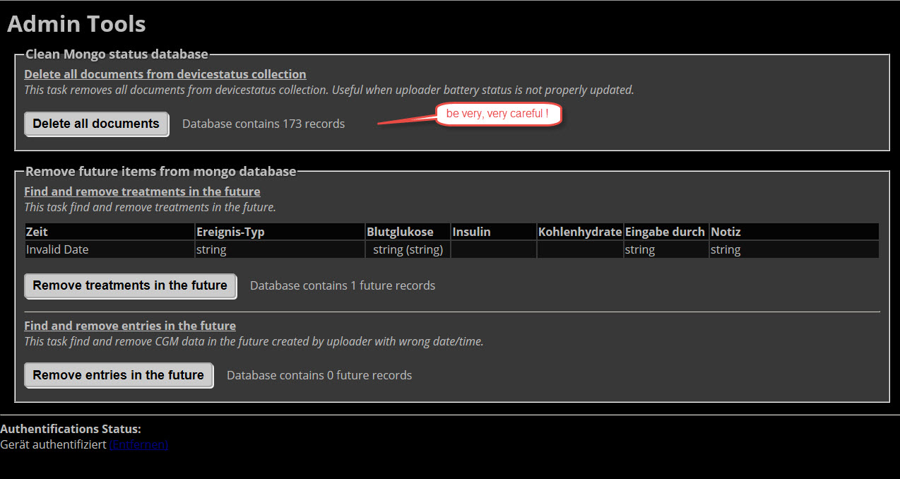

# Haupt Seite

In der Abbildung ist die Web Site mit Elementen zu sehen. Mit dem Klick auf das Ausschnittsfenster kann an die Ansicht von aktuellen Live Daten zu **RETRO** - Daten aus der Vergangenheit ändern.

**Hauptseite:**

Nach dem erstmaligem Aufruf rufen wir die **Einstellungen** auf. Hier kann man
weiter zu **Berichte**, **Profil-Einstellungen**, **Admin Tools** gelangen.
Über die Auswahlfelder konfiguriert man das Erscheinungsbild, die Sprache, Alarme
und Plugins. Bei Änderungen **Speichern** nicht vergessen.

**Einstellungen:**

Wir machen weiter mit den **Profil-Einstellungen**. Neben allgemeinen Einstellungen
 wird hier auch eingestellt, ob die Plugins angezeigt werden sollen, oder nicht.
Für Änderungen muss das Gerät, wie z.B. der Laptop authentifiziert sein, dazu ist das 
[API SECRET](../nightscout/azure.md) einzugeben. Am Ende machen wir ein **Update record**.

**Profil-Einstellungen:**

Die Dateneingabe erfolgt über das **+** Symbol der Website. Es gibt **Auswahl**- und **Werte**- Felder. Einige Plugins, wie bwp, benötigen hier Eingaben, damit sie Werte berechnen können. Mit **Eingabe senden** erscheint noch ein Bestätigungsbutton, klickt man diesen, werden die Werte gespeichert.

**Admin Tools**

Mit den Admin Tools ist es möglich, Daten zu löschen. Dieses betrifft im wesentlichen Nutzer der Nightscout Uploader App, welche Daten vom Dexcom Receiver via USB Kabel an das Android Smartphone übertragen. Bevor hier etwas geklickt wird, bitte genau überlegen, ob dieses wirklich nötig ist.

**Dateneingabe:**

Für die Dateneingabe muss das Plugin **careportal** mit **ENABLE** über [Azure](../nightscout/azure.md) konfiguriert sein.

**Grafische Darstellungen**

Grafik wird alle 60 Sekunden aktualisiert ?. Neben dem reinen CGM - Verlauf
werden auch Careportal Eingaben dargestellt. Die **Basalraten Visualisierung**
zeigt, sofern über die Azure App.-Einstellungen (basal) eingetragen und über den Profil Editor konfiguriert, den Verlauf an. Dieses ist geade für temporäre Basalraten interessant.

Temp Basal

AR2

AR2 generates alarms based on forecasted values. AR2 is enabled by default if no alarm thresholds are set or if the ALARM_TYPES variable includes predict. You can adjust AR2 behavior with the following extended settings variables:

    AR2_USE_RAW (to forecast using rawbg values when standard values don’t trigger an alarm; default is false)
    AR2_CONE_FACTOR (to adjust size of cone, use 0 for a single line; default is 2)

To learn more about AR2, see Forecasting Using AR2 Algorithm.
Simple Alarms

Pushover

See Pushover information for use with Funnel Cake.

Wir sehen uns den   [Profil Editor](../nightscout/nightscout_plugins.md) jetzt näher an.

