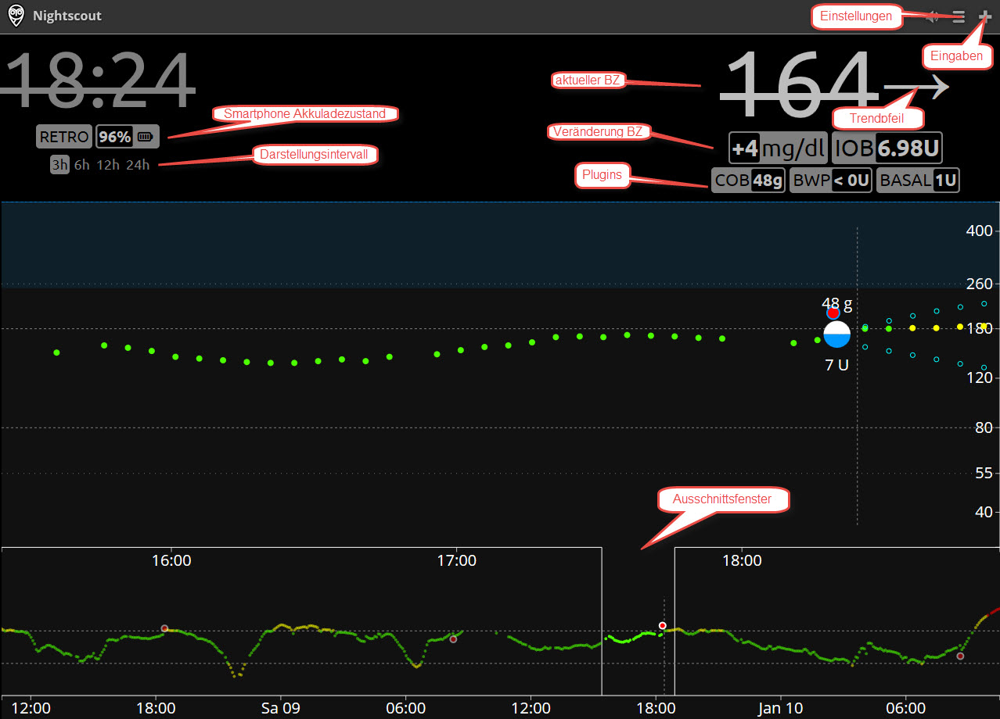
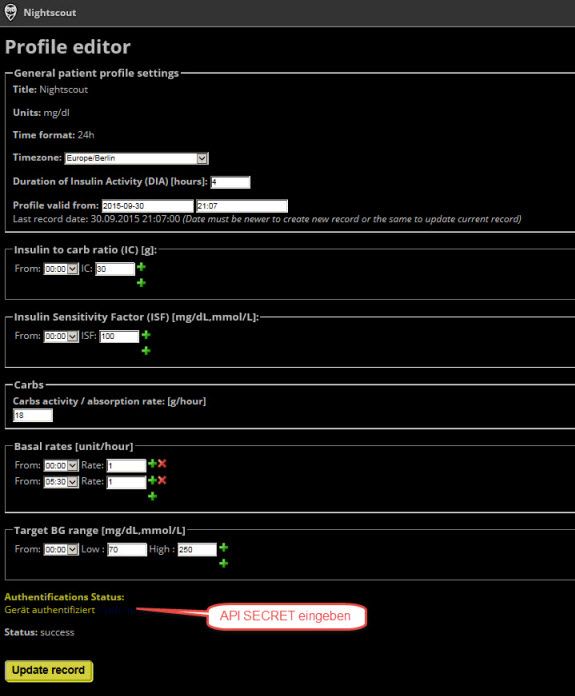
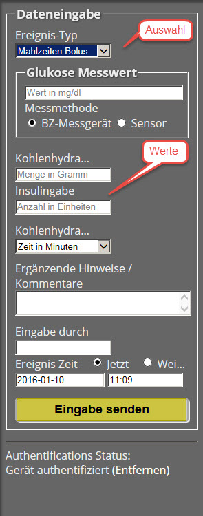

# Haupt Seite
baembel08

In der Abbildung ist die Web Site mit Elementen zu sehen. Mit dem Klick auf das Ausschnittsfenster kann an die Ansicht von aktuellen Live Daten zu **RETRO** - Daten aus der Vergangenheit ändern.

**Hauptseite:**

Nach dem erstmaligem Aufruf rufen wir die **Einstellungen** auf. Hier kann man
weiter zu **Berichte**, **Profil-Einstellungen**, **Admin Tools** gelangen.
Über die Auswahlfelder konfiguriert man das Erscheinungsbild, die Sprache, Alarme
und Plugins. Bei Änderungen **Speichern** nicht vergessen.

**Einstellungen:**

Wir machen weiter mit den **Profil-Einstellungen**. Neben allgemeinen Einstellungen
Einstellungen werden hier auch die Plugins konfiguriert.
Für Änderungen muss das Gerät, wie z.B. der Laptop authentifiziert sein, dazu ist das 
[API SECRET](https://ladyviktoria.gitbooks.io/nightscout_handbuch/content/nightscout/azure.html) einzugeben. Am Ende machen wir ein **Update record**.

**Profil-Einstellungen:**

Die Dateneingabe erfolgt über das **+** Symbol der Website. Es gibt **Auswahl**- und **Werte**- Felder. Mit **Eingabe senden** erscheint noch ein Bestätigungsbutton, klickt man diesen, werden die Werte gespeichert.

**Dateneingabe:**

Für die Dateneingabe muss das Plugin **careportal** mit ENABLE über [Azure](../nightscout/azure.md) konfiguriert sein.

Die Nightscout [Plugins](../nightscout/plugins.md) werden jetzt näher beschrieben.

