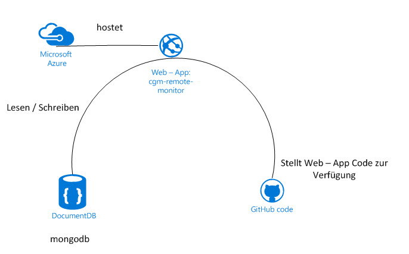

# Nightscout einrichten

Nightscout besteht aus **3 Komponenten**:

* Einer Dokumentations Datenbank (**Mongo DB**) zur Speicherung, von BZ, KH, Insulin usw.
* Einer **Web - Applikation**, welche über einen beliebigen Explorer oder ein App aufgerufen  werden kann. Die Anwendung wird in einem Repository aktualisiert, welche über einen webbasierten Filehosting Dienst **GitHub** verwaltet wird.
* Einem Cloud - Service Anbieter, welcher die Web - Applikation über Webserver zur Verfügung stellt. Microsoft [**Azure**](//azure.microsoft.com/de-de/pricing/free-trial/) oder **Heroku** können hierfür verwendet werden.
* 

Ein Schaubild verdeutlicht die Zusammmenhänge:

