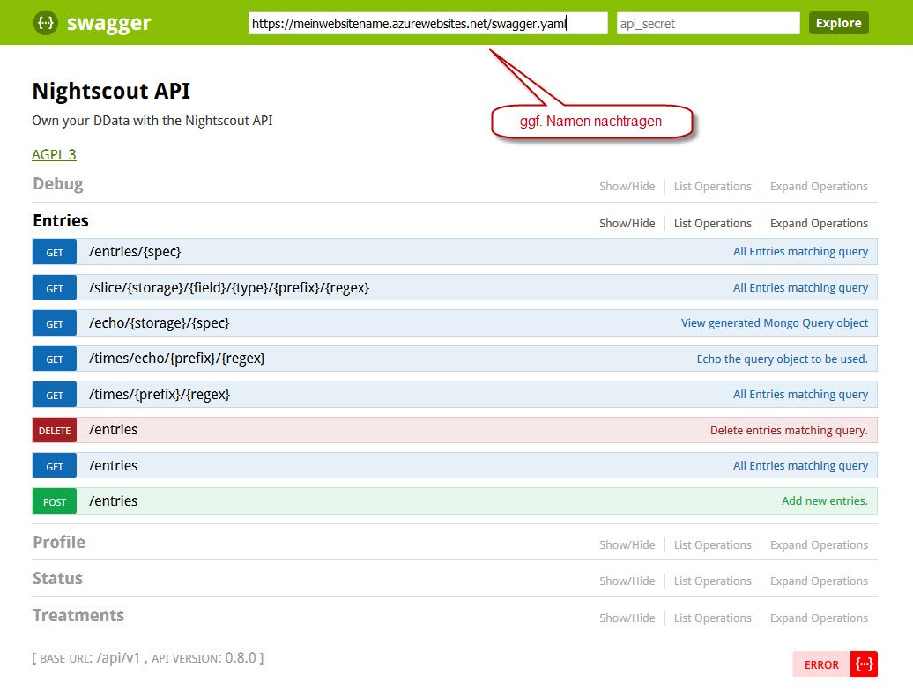

# Programmierbarkeit

Nightscout besteht aus einer **Applikations-** und einer **Datenbankschicht**.

# Applikationsschicht

Nightscout ist eine Open Source Software. Der Software Code ist frei im Internet über [GitHub](https://github.com/nightscout/cgm-remote-monitor) einsehbar. Jeder, der Interesse hat und sich zutraut am Programmcode mitzuentwickeln kann dieses tun. Die Kommunikation verläuft über [Gitter Chat](https://gitter.im/) in englischer Sprache.
Die Software wird auf einem Webserver gehostet. Sie wird über Webservices angesprochen, welche das API beschreibt.

Das [API]((https://de.wikipedia.org/wiki/Programmierschnittstelle) ) ist mit [Swagger](http://swagger.io/) dokumentiert. Swagger ist ein API Dokumentationswerkzeug, welches auf die [Open API Initiative](https://openapis.org/) aufbaut.

Wir können das  Nightscout API mit der Adresse:
https://meinwebsitename.azurewebsites.net/api-docs.html#/ aufrufen:

**Nightscout API:**

Sollten die Details nicht automatisch dargestellt werden, so bitte den Wert

https://meinwebsitename.azurewebsites.net/swagger.yaml eintragen und den Button Explore klicken.

Der Internet - Event Dienst IFTTT ([If This Than That](https://de.wikipedia.org/wiki/IFTTT)) verknüpft verschiedene Webanwendungen, um Daten auszutauschen. So können Benachrichtigungen, welche über Nightscout erzeugt werden, z.B. als Email weitergeleitet werden.
 
 
 
 
 powershell
 
 
 programmabilty
 
 
 
 
 # Datenbankschicht
 